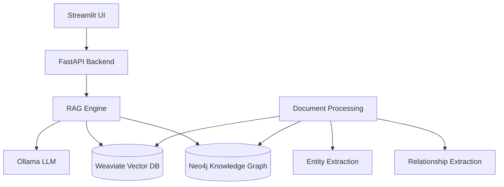

# Arete: AI Philosophy Tutor with Graph-RAG

> *"Excellence is never an accident. It is always the result of high intention, sincere effort, and intelligent execution"* - Aristotle

Arete is an advanced AI tutoring system specifically designed for classical philosophical texts, using a novel Graph-RAG (Retrieval-Augmented Generation) architecture to provide accurate, well-cited, and educationally valuable responses to philosophical questions.

## 🎯 Project Vision

Arete aims to democratize access to high-quality philosophical education by:
- Providing accurate, citation-backed answers to philosophical questions
- Making classical texts more accessible to modern students
- Supporting educators with AI-powered teaching assistance
- Preserving the nuance and complexity of philosophical discourse

## 🏗️ System Architecture

### Core Components



### Technology Stack

**AI/ML Stack:**
- 🧠 **LLM**: Ollama with OpenHermes-2.5 for local inference
- 🔍 **Embeddings**: sentence-transformers for semantic similarity
- 📊 **NER**: spaCy for entity extraction
- 🎯 **RAG**: Custom hybrid retrieval system

**Database Layer:**
- 📈 **Knowledge Graph**: Neo4j for entity relationships
- 🔗 **Vector Store**: Weaviate for semantic search
- 💾 **Caching**: Redis for performance optimization

**Backend Services:**
- 🐍 **API**: FastAPI with async support
- ⚙️ **Processing**: Celery for background tasks
- 📝 **Logging**: Loguru with structured logging
- 🧪 **Testing**: pytest with >90% coverage

**Frontend:**
- 🎨 **UI**: Streamlit for rapid development
- 📱 **Responsive**: Mobile-optimized interface
- ♿ **Accessible**: WCAG 2.1 AA compliance

## 🚀 Quick Start

### Prerequisites

- Python 3.11+
- Docker Desktop 4.0+
- 16GB RAM (recommended)
- NVIDIA GPU (optional, for faster inference)

### Installation

1. **Clone the repository:**
```bash
git clone https://github.com/arete-ai/arete.git
cd arete
```

2. **Install Python dependencies:**
```bash
pip install -e ".[dev,all]"
```

3. **Start the services:**
```bash
# Start database services
docker-compose up -d neo4j weaviate ollama

# Wait for services to be healthy
docker-compose ps

# Run database initialization
python scripts/init_databases.py
```

4. **Start the application:**
```bash
# Development mode
streamlit run src/arete/ui/streamlit_app.py

# Production mode
docker-compose up -d app
```

5. **Access the application:**
- Web Interface: http://localhost:8501
- API Documentation: http://localhost:8000/docs
- Neo4j Browser: http://localhost:7474
- Weaviate: http://localhost:8080

### Development Setup

```bash
# Install pre-commit hooks
pre-commit install

# Run tests
pytest tests/ -v --cov=src/arete

# Run linting
black src/ tests/
flake8 src/ tests/
mypy src/

# Generate documentation
sphinx-build -b html docs/ docs/_build/
```

## 📚 Usage Examples

### Basic Question Answering

```python
from arete import AreteClient

client = AreteClient()

# Ask a philosophical question
response = client.ask("What is Aristotle's view on virtue ethics?")
print(response.answer)
print(response.citations)
```

### Advanced Query with Context

```python
# Query with specific context
response = client.ask(
    question="How does Plato's theory of Forms relate to modern epistemology?",
    context="Plato's Republic, Books VI-VII",
    max_citations=5
)

# Get detailed explanations
for citation in response.citations:
    print(f"{citation.text} - {citation.source} ({citation.location})")
```

### Document Processing

```python
from arete.processing import DocumentProcessor

processor = DocumentProcessor()

# Process a new philosophical text
result = processor.process_document(
    file_path="data/plato_republic.pdf",
    metadata={"author": "Plato", "title": "Republic", "language": "English"}
)

print(f"Processed {result.chunks} chunks, extracted {result.entities} entities")
```

## 📖 Core Features

### 🎓 Educational Focus
- **Pedagogical Responses**: Answers structured for learning
- **Progressive Difficulty**: Adjusts complexity to user level
- **Socratic Method**: Asks follow-up questions to deepen understanding
- **Historical Context**: Places ideas in philosophical tradition

### 🔍 Advanced Retrieval
- **Hybrid Search**: Combines dense and sparse retrieval
- **Graph Traversal**: Explores conceptual relationships
- **Citation Accuracy**: Verifies all references against source texts
- **Relevance Ranking**: Multi-stage result refinement

### 🌐 Multi-language Support
- **Classical Languages**: Ancient Greek, Latin text processing
- **Modern Languages**: English, German, French philosophical texts
- **Transliteration**: Automatic Greek/Latin romanization
- **Cross-lingual Search**: Find concepts across language barriers

### 🔒 Quality Assurance
- **Expert Validation**: Human review for critical responses
- **Hallucination Detection**: Multiple validation layers
- **Citation Verification**: Automated accuracy checking
- **Bias Mitigation**: Balanced representation of viewpoints

## 🏛️ Supported Texts and Authors

### Ancient Philosophy
- **Plato**: Republic, Phaedo, Meno, Apology, and more
- **Aristotle**: Nicomachean Ethics, Metaphysics, Politics
- **Stoics**: Epictetus, Marcus Aurelius, Seneca
- **Pre-Socratics**: Heraclitus, Parmenides, Democritus

### Medieval Philosophy
- **Augustine**: Confessions, City of God
- **Thomas Aquinas**: Summa Theologica, Summa Contra Gentiles
- **Maimonides**: Guide for the Perplexed
- **Avicenna**: The Book of Healing

### Modern Philosophy
- **Descartes**: Meditations, Discourse on Method
- **Kant**: Critique of Pure Reason, Groundwork
- **Hume**: Enquiry Concerning Human Understanding
- **Spinoza**: Ethics, Theological-Political Treatise

*More texts are continuously being added. See our [content roadmap](docs/content_roadmap.md) for details.*

## 🧪 Testing and Quality

### Test Coverage
```bash
# Run full test suite
pytest tests/ -v --cov=src/arete --cov-report=html

# Run specific test categories
pytest tests/ -m unit          # Unit tests only
pytest tests/ -m integration   # Integration tests
pytest tests/ -m slow          # Long-running tests
```

### Quality Metrics
- **Test Coverage**: >90% for all modules
- **Response Accuracy**: >85% verified by experts
- **Citation Precision**: >95% accuracy rate
- **Performance**: <3s average response time

### Continuous Integration
- **GitHub Actions**: Automated testing on push/PR
- **Code Quality**: Black, flake8, mypy, pre-commit
- **Security**: Bandit security scanning
- **Documentation**: Automatic generation and deployment

## 📊 Development Progress

**Current Status**: Foundation Phase (Phase 1/7)
- ✅ Docker environment configured
- ✅ Database schemas created  
- ✅ Configuration management implemented
- 🔄 Core data models (in progress)
- ⏳ Database connections (next)

See [Development Progress](docs/development_progress.md) for detailed status.

### Roadmap

- **Phase 1** (Weeks 1-3): Foundation and Infrastructure ✅
- **Phase 2** (Weeks 4-6): Data Ingestion Pipeline 🔄
- **Phase 3** (Weeks 7-10): Retrieval and RAG System ⏳
- **Phase 4** (Weeks 8-10): LLM Integration and Generation ⏳
- **Phase 5** (Weeks 11-12): User Interface Development ⏳
- **Phase 6** (Weeks 13-15): Advanced Features ⏳
- **Phase 7** (Weeks 16-17): Production Deployment ⏳

## 🤝 Contributing

We welcome contributions from philosophers, developers, and educators!

### Getting Started
1. Read our [Contributing Guide](CONTRIBUTING.md)
2. Check the [Issues](https://github.com/arete-ai/arete/issues) for open tasks
3. Join our [Discord](https://discord.gg/arete-ai) community
4. Review our [Code of Conduct](CODE_OF_CONDUCT.md)

### Areas for Contribution
- 📚 **Content**: Digitizing and curating philosophical texts
- 🔬 **Research**: Improving NLP for philosophical language
- 💻 **Development**: Backend, frontend, and infrastructure
- 🎨 **Design**: UI/UX and educational experience
- 📖 **Documentation**: Guides, tutorials, and references
- 🧪 **Testing**: Quality assurance and validation

### Development Process
1. **TDD Approach**: Write tests before implementation
2. **Code Review**: All changes reviewed by maintainers
3. **Expert Validation**: Philosophical accuracy verified
4. **Incremental Delivery**: Regular releases with working features

## 📄 License

This project is licensed under the MIT License - see the [LICENSE](LICENSE) file for details.

## 🙏 Acknowledgments

- **Perseus Digital Library**: For digitized classical texts
- **GRETIL**: For Sanskrit and Indian philosophy resources
- **Stanford Encyclopedia of Philosophy**: For philosophical expertise
- **Open Source Community**: For the amazing tools that make this possible

## 📞 Support and Community

- 📧 **Email**: support@arete.ai
- 💬 **Discord**: [Arete AI Community](https://discord.gg/arete-ai)
- 🐦 **Twitter**: [@AreteAI](https://twitter.com/AreteAI)
- 📖 **Documentation**: [docs.arete.ai](https://docs.arete.ai)
- 🐛 **Bug Reports**: [GitHub Issues](https://github.com/arete-ai/arete/issues)

## 🎯 Project Goals

1. **Accessibility**: Make philosophy education available to everyone
2. **Accuracy**: Provide reliable, well-sourced information
3. **Pedagogy**: Support effective learning and teaching
4. **Preservation**: Digitally preserve and contextualize classical texts
5. **Innovation**: Advance AI applications in humanities education

---

*"The unexamined life is not worth living." - Socrates*

**Built with ❤️ for philosophical inquiry and educational excellence.**