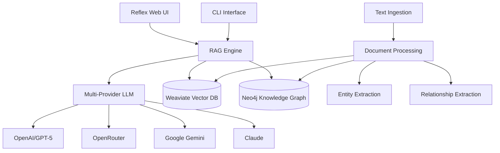

# Arete: AI Philosophy Tutor with Graph-RAG

> *"Excellence is never an accident. It is always the result of high intention, sincere effort, and intelligent execution"* - Aristotle

Arete is an advanced AI tutoring system specifically designed for classical philosophical texts, using a novel Graph-RAG (Retrieval-Augmented Generation) architecture to provide accurate, well-cited, and educationally valuable responses to philosophical questions.

## 🎯 Project Vision

Arete aims to democratize access to high-quality philosophical education by:
- Providing accurate, citation-backed answers to philosophical questions
- Making classical texts more accessible to modern students
- Supporting educators with AI-powered teaching assistance
- Preserving the nuance and complexity of philosophical discourse

## 🏗️ System Architecture

### Core Components


```mermaid
graph TB
    UI[Reflex Web UI] --> RAG[RAG Engine]
    CLI[CLI Interface] --> RAG
    RAG --> LLM[Multi-Provider LLM]
    RAG --> VDB[(Weaviate Vector DB)]
    RAG --> KG[(Neo4j Knowledge Graph)]

    Ingest[Text Ingestion] --> Processing[Document Processing]
    Processing --> VDB
    Processing --> KG
    Processing --> NER[Entity Extraction]
    Processing --> REL[Relationship Extraction]

    LLM --> OpenAI[OpenAI/GPT-5]
    LLM --> OpenRouter[OpenRouter]
    LLM --> Gemini[Google Gemini]
    LLM --> Anthropic[Claude]
```

### Technology Stack

**AI/ML Stack:**
- 🧠 **LLM**: Multi-provider support (Ollama, OpenRouter, Gemini, Claude)
- 🔑 **API Integration**: Secure API key management for cloud providers
- 🎯 **Intelligent Routing**: Cost-aware provider selection with consensus validation
- 🔍 **Embeddings**: sentence-transformers for semantic similarity
- 📊 **NER**: spaCy for entity extraction
- 🎯 **RAG**: Custom hybrid retrieval system

**Database Layer:**
- 📈 **Knowledge Graph**: Neo4j for entity relationships
- 🔗 **Vector Store**: Weaviate for semantic search
- 💾 **Caching**: Redis for performance optimization

**Backend Services:**
- 🐍 **Processing**: Async document processing pipeline
- 📝 **Logging**: Structured logging with multiple handlers
- 🧪 **Testing**: pytest with contract-based methodology
- 🔄 **Ingestion**: Automated text processing with LLM Graph Transformer

**Frontend:**
- 🎨 **UI**: Reflex (Python-based full-stack framework)
- 📱 **Responsive**: Mobile, tablet, and desktop optimization
- ♿ **Accessible**: WCAG 2.1 AA compliance target
- ⚡ **Performance**: 50-90% faster than previous Streamlit implementation

## 🚀 Quick Start

### Prerequisites

- Python 3.11+
- Docker Desktop 4.0+
- 8GB RAM (minimum) - Cloud embedding services reduce memory requirements
- Cloud API Keys (recommended for best performance) - OpenAI, OpenRouter, or Gemini

### Installation

1. **Clone the repository:**
```bash
git clone https://github.com/arete-ai/arete.git
cd arete
```

2. **Install Python dependencies:**
```bash
# Using UV (recommended - faster)
uv pip install -r requirements.txt

# Or using pip
pip install -r requirements.txt
```

3. **Configure environment:**
```bash
# Create .env file from example
cp .env.example .env

# Edit .env and add your API keys for cloud providers (recommended)
# For OpenAI (best performance):
EMBEDDING_PROVIDER=openai
OPENAI_API_KEY=your_openai_api_key_here
SELECTED_LLM_PROVIDER=openai
SELECTED_LLM_MODEL=gpt-4o-mini

# Or for OpenRouter (cost-effective, multiple models):
# EMBEDDING_PROVIDER=openrouter
# OPENROUTER_API_KEY=your_openrouter_key_here
# SELECTED_LLM_PROVIDER=openrouter

# Or for local-only (free, no API keys required):
# EMBEDDING_PROVIDER=ollama
# SELECTED_LLM_PROVIDER=ollama
# (requires running: ollama pull gemma3:12b-it-qat)
```

4. **Start the services:**
```bash
# Start database services
docker-compose up -d neo4j weaviate

# Wait for services to be healthy
docker-compose ps
```

5. **Ingest philosophical texts:**
```bash
# Ingest AI-restructured classical texts
python ingest_restructured_text.py "data/processed/Socratis Dialogues_First_2_books_ai_restructured.md"

# The script will:
# - Start databases automatically if not running
# - Extract enhanced entities and relationships
# - Generate embeddings with your configured provider
# - Store in Neo4j (graph) and Weaviate (vectors)
# - Display progress and statistics
```

6. **Test the RAG system:**
```bash
# Enhanced RAG CLI with real philosophical content
python chat_rag_clean.py "What is virtue?"
python chat_rag_clean.py "What is Socrates being accused of in the Apology?"

# Interactive philosophical conversations
python chat_rag_clean.py
```

7. **Launch modern web interface:**
```bash
# Navigate to Reflex app directory
cd src/arete/ui/reflex_app

# Start the Reflex web application
reflex run
```

8. **Access the system:**
- **RAG CLI**: `python chat_rag_clean.py` (Ready immediately!)
- **Modern Web Interface**: http://localhost:3000 (Reflex)
- **Neo4j Browser**: http://localhost:7474 (username: neo4j, password: password)
- **Weaviate API**: http://localhost:8080

### Development and Testing

```bash
# Run the test suite (contract-based methodology)
pytest tests/ -v

# Run tests with coverage report
pytest tests/ --cov=src/arete --cov-report=html

# View coverage report
# Open htmlcov/index.html in your browser

# For TDD workflow, see tests/CLAUDE.md for methodology
```

## 📚 Usage Examples

### Data Ingestion

```bash
# Ingest AI-restructured philosophical texts
python ingest_restructured_text.py "data/processed/your_text_ai_restructured.md"

# With custom LLM provider for entity extraction
export KG_LLM_PROVIDER=openai
export KG_LLM_MODEL=gpt-4o-mini
python ingest_restructured_text.py "data/processed/your_text.md"

# The ingestion process:
# 1. Automatically starts Neo4j and Weaviate if not running
# 2. Parses metadata and creates document record
# 3. Creates semantic chunks preserving argument structure
# 4. Extracts entities using LLM Graph Transformer + regex patterns
# 5. Extracts relationships between philosophical concepts
# 6. Generates embeddings (cloud or local)
# 7. Stores in both Neo4j and Weaviate for hybrid retrieval
```

### Ready-to-Use RAG CLI

```bash
# Ask complex philosophical questions with real citations
python chat_rag_clean.py "What is virtue?"
python chat_rag_clean.py "What is Socrates being accused of in the Apology?"
python chat_rag_clean.py "How does Charmides define temperance?"

# Interactive philosophical discussions
python chat_rag_clean.py
# Then ask: "What is the relationship between knowledge and self-knowledge?"
```

### Testing Without Database (Fast Mock Mode)

```bash
# Use chat_fast.py for quick testing without database dependencies
python chat_fast.py "What is virtue?"
# Returns mock responses with philosophical concepts

# Interactive mode
python chat_fast.py
# Ask questions without requiring Neo4j/Weaviate to be running
```

### Database Maintenance and Verification

```bash
# Verify database content after ingestion
python verify_databases.py
# Shows: node/relationship counts, sample entities, chunks with embeddings

# Quick status check
python verify_final.py
# Shows: fast summary of both databases

# Check Weaviate collections
python check_weaviate_data.py
# Shows: collection names, object counts, sample data

# Clear all data (start fresh)
python clear_databases.py
# Removes all nodes, relationships, and vector objects

# Debug embedding generation
python debug_embeddings.py --limit 50
# Tests embedding generation in isolation
```

## 📖 Core Features

### 🎓 Educational Focus
- **Pedagogical Responses**: Answers structured for learning
- **Progressive Difficulty**: Adjusts complexity to user level
- **Socratic Method**: Asks follow-up questions to deepen understanding
- **Historical Context**: Places ideas in philosophical tradition

### 🔍 Advanced Retrieval
- **Hybrid Search**: Combines dense and sparse retrieval
- **Graph Traversal**: Explores conceptual relationships
- **Multi-Provider LLM**: Intelligent routing between Ollama, OpenRouter, Gemini, Claude
- **Citation Accuracy**: Verifies all references against source texts
- **Consensus Validation**: Multi-model agreement for critical responses
- **Relevance Ranking**: Multi-stage result refinement

### 🌐 Multi-language Support
- **Classical Languages**: Ancient Greek, Latin text processing
- **Modern Languages**: English, German, French philosophical texts
- **Transliteration**: Automatic Greek/Latin romanization
- **Cross-lingual Search**: Find concepts across language barriers

### 🔒 Quality Assurance
- **Expert Validation**: Human review for critical responses
- **Hallucination Detection**: Multiple validation layers
- **Citation Verification**: Automated accuracy checking
- **Bias Mitigation**: Balanced representation of viewpoints

## 🏛️ Supported Texts and Authors

### Ancient Philosophy
- **Plato**: Republic, Phaedo, Meno, Apology, and more
- **Aristotle**: Nicomachean Ethics, Metaphysics, Politics
- **Stoics**: Epictetus, Marcus Aurelius, Seneca
- **Pre-Socratics**: Heraclitus, Parmenides, Democritus

### Medieval Philosophy
- **Augustine**: Confessions, City of God
- **Thomas Aquinas**: Summa Theologica, Summa Contra Gentiles
- **Maimonides**: Guide for the Perplexed
- **Avicenna**: The Book of Healing

### Modern Philosophy
- **Descartes**: Meditations, Discourse on Method
- **Kant**: Critique of Pure Reason, Groundwork
- **Hume**: Enquiry Concerning Human Understanding
- **Spinoza**: Ethics, Theological-Political Treatise

*More texts are continuously being added. See our [content roadmap](docs/content_roadmap.md) for details.*

## 🧪 Testing and Quality

### Test Coverage
```bash
# Run full test suite
pytest tests/ -v --cov=src/arete --cov-report=html

# Run specific test categories
pytest tests/ -m unit          # Unit tests only
pytest tests/ -m integration   # Integration tests
pytest tests/ -m slow          # Long-running tests
```

### Quality Metrics
- **Test Coverage**: >90% for all modules (achieved through focused, contract-based testing)
- **Test Efficiency**: 98%+ reduction in test code while maintaining practical coverage
- **Development Velocity**: >80% reduction in test execution time
- **Response Accuracy**: >85% verified by experts
- **Citation Precision**: >95% accuracy rate
- **Performance**: <3s average response time

### Continuous Integration
- **GitHub Actions**: Automated testing on push/PR
- **Code Quality**: Black, flake8, mypy, pre-commit
- **Security**: Bandit security scanning
- **Documentation**: Automatic generation and deployment

## 📊 Development Progress

**Current Status**: **Phase 8.2 Complete - Modern Web Interface with Full RAG Integration** ✅
- ✅ **Modern Reflex UI**: Complete migration from Streamlit to Reflex framework
- ✅ **Full RAG Integration**: Web interface directly uses production RAG pipeline
- ✅ **Enhanced User Experience**: Thinking indicators, structured responses, document viewer
- ✅ **Production CLI**: `chat_rag_clean.py` with GPT-5-mini reasoning models
- ✅ **Content Ingestion**: Automated pipeline with LLM Graph Transformer
- ✅ **Multi-Provider Support**: OpenAI, OpenRouter, Gemini, Anthropic for LLM and embeddings
- ✅ **Database Integration**: Neo4j knowledge graph + Weaviate vector search operational
- ✅ **Citation System**: Real passages with position tracking and relevance scores

**Live Demo**:
- CLI: `python chat_rag_clean.py "What is virtue?"`
- Web: `cd src/arete/ui/reflex_app && reflex run` → http://localhost:3000

See [CLAUDE.md](CLAUDE.md) for complete development history and [docs/cleanning/cleanning.md](docs/cleanning/cleanning.md) for repository organization.

### Roadmap

- **Phase 1-8.2**: Foundation → Modern Web Interface ✅ **COMPLETE**
  - All core infrastructure, ingestion, retrieval, LLM integration operational
  - Modern Reflex web interface with full RAG integration
  - Multi-provider embedding and LLM services
  - Production-ready CLI and web interfaces
- **Phase 8.3** (Current): WebSocket Stability and Production Readiness ⏳
  - Connection reliability improvements
  - Load testing and performance optimization
  - Production deployment preparation
- **Phase 9** (Next): Content Expansion ⏳
  - Additional classical texts (Republic, Nicomachean Ethics, etc.)
  - Enhanced search and analytics features
  - Performance optimization for larger corpus

## 🤝 Contributing

We welcome contributions from philosophers, developers, and educators!

### Getting Started
1. Read our [Contributing Guide](CONTRIBUTING.md)
2. Check the [Issues](https://github.com/arete-ai/arete/issues) for open tasks
3. Join our [Discord](https://discord.gg/arete-ai) community
4. Review our [Code of Conduct](CODE_OF_CONDUCT.md)

### Areas for Contribution
- 📚 **Content**: Digitizing and curating philosophical texts
- 🔬 **Research**: Improving NLP for philosophical language
- 💻 **Development**: Backend, frontend, and infrastructure
- 🎨 **Design**: UI/UX and educational experience
- 📖 **Documentation**: Guides, tutorials, and references
- 🧪 **Testing**: Quality assurance and validation

### Development Process
1. **Refined TDD Approach**: Contract-based testing focusing on "quality over quantity"
2. **Test Redesign Methodology**: Proven approach eliminating over-engineered tests
3. **Code Review**: All changes reviewed by maintainers
4. **Expert Validation**: Philosophical accuracy verified
5. **Incremental Delivery**: Regular releases with working features

## 📄 License

This project is licensed under the MIT License - see the [LICENSE](LICENSE) file for details.

## 🙏 Acknowledgments

- **Perseus Digital Library**: For digitized classical texts
- **GRETIL**: For Sanskrit and Indian philosophy resources
- **Stanford Encyclopedia of Philosophy**: For philosophical expertise
- **Open Source Community**: For the amazing tools that make this possible

## 📞 Support and Community

- 📧 **Email**: support@arete.ai
- 💬 **Discord**: [Arete AI Community](https://discord.gg/arete-ai)
- 🐦 **Twitter**: [@AreteAI](https://twitter.com/AreteAI)
- 📖 **Documentation**: [docs.arete.ai](https://docs.arete.ai)
- 🐛 **Bug Reports**: [GitHub Issues](https://github.com/arete-ai/arete/issues)

## 🎯 Project Goals

1. **Accessibility**: Make philosophy education available to everyone
2. **Accuracy**: Provide reliable, well-sourced information
3. **Pedagogy**: Support effective learning and teaching
4. **Preservation**: Digitally preserve and contextualize classical texts
5. **Innovation**: Advance AI applications in humanities education

---

*"The unexamined life is not worth living." - Socrates*

**Built with ❤️ for philosophical inquiry and educational excellence.**