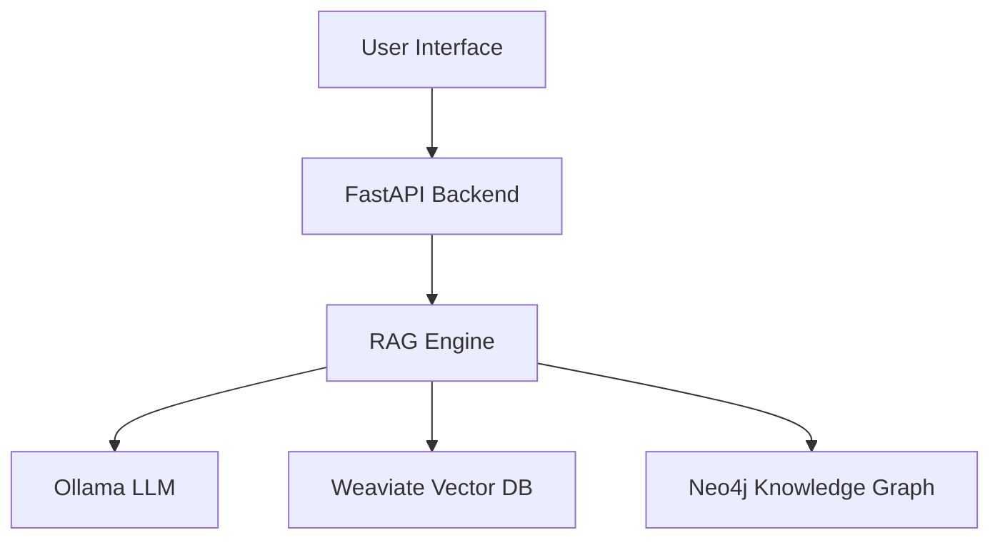

# Documentation Directory - Claude Memory

## Purpose & Organization

This directory contains all project documentation, progress tracking, and knowledge artifacts for the Arete Graph-RAG system.

```
docs/
├── CLAUDE.md                    # This file - documentation memory
├── development_progress.md ✅    # Current development status and progress
├── README.md ✅                 # Project overview and quick start guide
├── api/                         # API documentation (PLANNED)
│   ├── endpoints.md             # REST API endpoint documentation
│   ├── graphql_schema.md        # GraphQL schema documentation
│   └── websocket_events.md      # WebSocket event documentation
├── architecture/                # System architecture documentation (PLANNED)
│   ├── system_overview.md       # High-level system architecture
│   ├── database_design.md       # Database schema and relationships
│   ├── rag_pipeline.md          # RAG system detailed design
│   └── security_design.md       # Security architecture and considerations
├── user_guide/                  # End-user documentation (PLANNED)
│   ├── getting_started.md       # User onboarding guide
│   ├── asking_questions.md      # How to interact with the system
│   ├── understanding_responses.md # How to interpret AI responses
│   └── citation_guide.md        # Understanding citations and sources
├── developer_guide/             # Technical documentation (PLANNED)
│   ├── setup_guide.md           # Development environment setup
│   ├── contributing.md          # Development workflow and standards
│   ├── testing_guide.md         # Testing strategies and best practices
│   └── deployment_guide.md      # Production deployment instructions
├── philosophy/                  # Domain-specific documentation (PLANNED)
│   ├── supported_texts.md       # List of supported philosophical works
│   ├── entity_taxonomy.md       # Philosophical entity classification system
│   ├── accuracy_standards.md    # Quality assurance for philosophical content
│   └── expert_validation.md     # Expert review process and standards
└── research/                    # Research and experimental documentation (PLANNED)
    ├── nlp_experiments.md       # NLP research for philosophical texts
    ├── evaluation_metrics.md    # System evaluation methodologies
    ├── benchmark_results.md     # Performance and accuracy benchmarks
    └── future_research.md       # Identified research opportunities
```

## Completed Documentation

### development_progress.md ✅
**Purpose**: Comprehensive tracking of development progress, current status, and technical decisions.

**Key Sections**:
- **Current Status**: Phase 1 (Foundation) - 15% complete
- **Completed Tasks**: Docker setup, database schemas, configuration system
- **Implementation Details**: Detailed technical information about completed components
- **Next Steps**: Prioritized list of upcoming development tasks
- **Architecture Decisions**: Key technical choices and rationale
- **Quality Metrics**: Test coverage, performance targets, quality standards

**Usage**: 
- Primary reference for development team
- Updated after each major milestone
- Referenced in planning meetings and progress reviews

**Last Updated**: 2025-08-08

### README.md ✅  
**Purpose**: Main project introduction, quick start guide, and community entry point.

**Key Sections**:
- **Project Vision**: Clear articulation of Arete's educational mission
- **Architecture Overview**: High-level system diagram and component descriptions
- **Quick Start**: Step-by-step installation and setup instructions
- **Usage Examples**: Code samples demonstrating key functionality
- **Core Features**: Educational focus, advanced retrieval, multi-language support
- **Supported Texts**: List of philosophical works and authors
- **Contributing Guidelines**: How to get involved in the project
- **Development Progress**: Current status and roadmap

**Target Audience**: 
- New contributors and developers
- Potential users and educators  
- Open source community
- Academic researchers

## Documentation Standards & Conventions

### Writing Style
- **Clear and Concise**: Technical accuracy without unnecessary complexity
- **Audience-Aware**: Tailored to specific reader needs (developer vs. end-user)
- **Example-Rich**: Code samples and concrete examples for all concepts
- **Update-Friendly**: Structured for easy maintenance and updates

### Markdown Standards
```markdown
# Main Title (H1) - One per document
## Section Headers (H2) - Major sections  
### Subsections (H3) - Detailed topics
#### Minor Subsections (H4) - Specific details

**Bold** for emphasis and key terms
*Italic* for filenames and technical terms
`Code` for inline code and commands
```

### Code Documentation Pattern
```markdown
### Configuration Example
```python
# Always include imports
from arete.config import get_settings

# Provide working examples
settings = get_settings()
print(f"Neo4j URI: {settings.neo4j_uri}")
```

**Key Points:**
- Import statements show required dependencies
- Examples demonstrate actual usage patterns
- Comments explain non-obvious behavior
```

### Documentation Linking
```markdown
# Internal links (relative paths)
See [Development Progress](development_progress.md) for details.
See [Configuration Guide](../config/CLAUDE.md) for setup.

# External links (absolute URLs)  
Check the [Neo4j Documentation](https://neo4j.com/docs/) for more information.

# Anchor links within document
Jump to [Database Setup](#database-setup) section below.
```

## Planned Documentation Structure

### API Documentation (PLANNED)
**Target Completion**: Week 8 (after API implementation)

#### endpoints.md
```markdown
# Arete API Endpoints

## Authentication
All API endpoints require authentication via API key.

## Query Endpoints

### POST /api/v1/query
Ask a philosophical question and receive a response with citations.

**Request:**
```json
{
  "question": "What is Aristotle's view on virtue ethics?",
  "context": "Nicomachean Ethics",
  "max_citations": 5
}
```

**Response:**
```json
{
  "answer": "Aristotle's virtue ethics centers on...",
  "citations": [
    {
      "text": "Virtue is a disposition...",
      "source": "Nicomachean Ethics",
      "book": "II",
      "chapter": "6", 
      "page": "1106b"
    }
  ],
  "confidence": 0.92
}
```
```

### Architecture Documentation (PLANNED)
**Target Completion**: Week 6 (after RAG system completion)

#### system_overview.md
```markdown
# Arete System Architecture

## High-Level Overview


## Component Responsibilities
- **RAG Engine**: Hybrid retrieval and response generation
- **Vector Database**: Semantic similarity search
- **Knowledge Graph**: Entity relationships and citations
- **LLM**: Local inference with OpenHermes-2.5
```

### User Guide Documentation (PLANNED) 
**Target Completion**: Week 12 (after UI completion)

#### asking_questions.md
```markdown
# How to Ask Effective Philosophical Questions

## Question Types

### **Conceptual Questions**
- "What is Kant's categorical imperative?"
- "How does Plato define justice?"

### **Comparative Questions**  
- "How do Aristotle and Kant differ on virtue ethics?"
- "What is the relationship between Stoicism and Buddhism?"

### **Historical Questions**
- "How did ancient Greek philosophy influence medieval thought?"
- "What led to the decline of scholasticism?"

## Getting Better Responses

### **Be Specific**
- ❌ "Tell me about ethics"
- ✅ "What are the main components of Aristotle's virtue ethics theory?"

### **Provide Context**
- "In the context of Plato's Republic, how is justice defined?"
- "According to Kant's Groundwork for the Metaphysics of Morals..."

### **Ask for Examples**
- "Can you provide examples of Stoic practices for developing virtue?"
- "What are some applications of utilitarian thinking in modern ethics?"
```

### Developer Guide (PLANNED)
**Target Completion**: Week 5 (after core development)

#### testing_guide.md
```markdown
# Testing Guide for Arete Developers

## Test-Driven Development Process

### 1. Red Phase: Write Failing Test
```python
def test_entity_extraction_from_text():
    """Test extracting philosophical entities from text."""
    text = "Socrates taught that virtue is knowledge."
    extractor = EntityExtractor()
    
    entities = extractor.extract(text)
    
    assert len(entities) >= 2
    assert any(e.name == "Socrates" and e.type == "Person" for e in entities)
    assert any(e.name == "virtue" and e.type == "Concept" for e in entities)
```

### 2. Green Phase: Minimal Implementation
```python
class EntityExtractor:
    def extract(self, text: str) -> List[Entity]:
        # Minimal implementation to pass test
        entities = []
        if "Socrates" in text:
            entities.append(Entity(name="Socrates", type="Person"))
        if "virtue" in text:
            entities.append(Entity(name="virtue", type="Concept"))
        return entities
```

### 3. Refactor Phase: Robust Implementation
```python
class EntityExtractor:
    def __init__(self):
        self.nlp = spacy.load("en_core_web_sm")
        self.philosophy_terms = load_philosophy_vocabulary()
    
    def extract(self, text: str) -> List[Entity]:
        doc = self.nlp(text)
        entities = []
        
        for ent in doc.ents:
            if ent.label_ == "PERSON":
                entities.append(Entity(name=ent.text, type="Person"))
            elif ent.text.lower() in self.philosophy_terms:
                entities.append(Entity(name=ent.text, type="Concept"))
        
        return entities
```
```

### Philosophy Domain Documentation (PLANNED)
**Target Completion**: Week 10 (ongoing throughout development)

#### supported_texts.md
```markdown
# Supported Philosophical Texts

## Ancient Philosophy (750 BCE - 500 CE)

### Greek Philosophy
- **Plato (428-348 BCE)**
  - Republic (Complete) - 10 books, ~380 pages
  - Phaedo (Complete) - Death of Socrates, immortality of soul  
  - Meno (Complete) - Theory of recollection
  - Apology (Complete) - Socrates' trial defense
  - Status: ✅ Processed, validated, citations verified

- **Aristotle (384-322 BCE)**
  - Nicomachean Ethics (Complete) - 10 books, virtue ethics
  - Metaphysics (Books I-XII) - Being qua being, substance
  - Politics (Complete) - Theory of state and governance
  - Status: 🔄 Processing, expected completion Week 8

### Processing Status Legend
- ✅ Complete: Fully processed, validated, and available
- 🔄 Processing: Currently being digitized and validated
- ⏳ Planned: Scheduled for future processing
- 🚫 Blocked: Awaiting copyright clearance or expert review
```

## Documentation Maintenance Process

### Update Triggers
1. **Code Changes**: Update technical docs when implementation changes
2. **Feature Completion**: Update user guides when new features are ready
3. **Milestones**: Update progress docs at phase completions
4. **Issues Resolved**: Update troubleshooting guides when bugs are fixed

### Review Process
1. **Accuracy Review**: Technical accuracy by domain experts
2. **Clarity Review**: Readability by target audience representatives
3. **Currency Review**: Information freshness and relevance
4. **Link Review**: Verify all internal and external links work

### Versioning Strategy
```markdown
# Document versioning in frontmatter
---
version: 2.1
last_updated: 2025-08-08
reviewers: [john_doe, jane_smith]
next_review: 2025-09-08
---
```

## Documentation Tools & Automation

### Generation Tools (PLANNED)
```bash
# API documentation from code annotations
python scripts/generate_api_docs.py

# Code coverage documentation  
pytest --cov=src/arete --cov-report=html
cp htmlcov/* docs/coverage/

# Architecture diagrams from code
python scripts/generate_architecture_diagrams.py
```

### Quality Checks
```bash
# Link checking
markdown-link-check docs/**/*.md

# Spelling and grammar
vale docs/

# Markdown formatting
markdownlint docs/
```

## Analytics & Feedback

### Documentation Usage (PLANNED)
- **Analytics**: Track which docs are most accessed
- **Feedback**: Collect user feedback on documentation quality
- **Gap Analysis**: Identify missing or unclear documentation

### Community Contributions
- **Editing**: Community can suggest edits via GitHub
- **Translation**: Multi-language documentation support planned
- **Examples**: Community-contributed usage examples

## Next Documentation Priorities

1. **Testing Environment Setup** (IMMEDIATE)
   - Document test database configuration
   - Add testing workflow documentation
   - Create troubleshooting guide

2. **API Documentation** (WEEK 8)
   - Auto-generate from FastAPI annotations
   - Include authentication and rate limiting
   - Add client SDK documentation

3. **User Guide** (WEEK 12)
   - End-user onboarding flow
   - Question-asking best practices
   - Citation interpretation guide

4. **Philosophy Domain Docs** (ONGOING)
   - Supported texts and authors
   - Entity taxonomy and relationships
   - Accuracy validation process

---

**Last Updated**: 2025-08-08  
**Current Focus**: Foundation documentation, user guides pending UI completion  
**Maintenance**: Updated after each major milestone and quarterly reviews