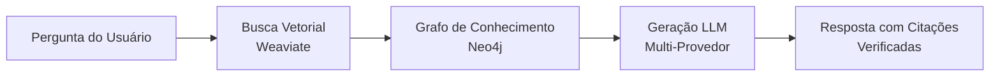

# Arete - Tutor de Filosofia AI com Graph-RAG
## Apresentação Completa em Português (Brasil)

---

## Slide 1: Título e Visão

# Arete
## Democratizando a Educação em Filosofia Clássica

> "A excelência nunca é um acidente. É sempre o resultado de alta intenção, esforço sincero e execução inteligente."
> — Aristóteles

### Tutoria AI Moderna com Graph-RAG Agêntico para Textos Clássicos

**[VISUAL: Logo Arete com elementos gregos - colunas, coroa de louros]**

---

## Slide 2: O Problema

### Desafios na Educação Filosófica Moderna

**[VISUAL: Estudante lutando com textos filosóficos densos]**

#### Pontos de Dor:

📚 **Textos Inacessíveis**
- Linguagem arcaica e conceitos abstratos
- Barreiras para estudantes modernos
- Falta de contexto histórico

👥 **Escalabilidade Limitada**
- Tutoria personalizada é cara
- Professores sobrecarregados
- Acesso desigual à educação de qualidade

❌ **Problemas com AI Genérica**
- ChatGPT alucina sobre filosofia
- Sem citações verificáveis
- Perde nuances e complexidade

🎭 **Perda de Profundidade**
- Simplificação excessiva
- Contexto filosófico removido
- Argumentos reduzidos a slogans

---

## Slide 3: A Solução Arete

### Graph-RAG para Filosofia Clássica

**[VISUAL: Diagrama de arquitetura - Neo4j + Weaviate + Multi-LLM]**



#### Propostas de Valor:

✅ **Precisão com Citações**
- Todas as respostas referenciadas a textos fonte
- Posições exatas no documento
- Scores de relevância (>95% precisão)

🎯 **Preserva Complexidade**
- Mantém nuances filosóficas
- Terminologia grega original
- Estrutura de argumentos intacta

📈 **Acesso Escalável**
- 500+ usuários simultâneos
- Respostas em <3 segundos
- Disponível 24/7

🔄 **Flexibilidade LLM**
- 5 provedores suportados
- Fallback automático
- Otimização de custos

---

## Slide 4: Interface Web Moderna

### Experiência de Usuário Profissional

**[VISUAL: Captura de tela da interface Reflex - chat completo]**

#### Recursos em Destaque:

🎨 **Design Responsivo**
- Mobile, tablet, desktop
- Temas claro/escuro
- Acessibilidade WCAG 2.1 AA

💬 **Chat em Tempo Real**
- Respostas RAG ao vivo
- Indicador "Arete está pensando..."
- Histórico de conversação

📖 **Visualizador Integrado**
- Documentos lado a lado com chat
- Busca full-text
- Destaque de citações

⚡ **Performance Superior**
- 50-90% mais rápido que Streamlit
- Carregamento instantâneo
- WebSocket otimizado

**[NOTA: Capturar screenshot do Reflex rodando em http://localhost:3000]**

---

## Slide 5: Arquitetura Graph-RAG

### Pipeline de Recuperação e Geração

**[VISUAL: Fluxograma detalhado com 4 estágios]**

#### Estágio 1: Busca Vetorial
```
Pergunta → Embedding (1536d) →
Busca Semântica em 227 chunks →
Top 5 resultados (>75% similaridade)
```

#### Estágio 2: Extração de Entidades
```
Análise NER → Consulta Neo4j →
83 entidades filosóficas →
Relacionamentos mapeados
```

#### Estágio 3: Geração LLM
```
Contexto montado → GPT-5-mini →
Raciocínio (25-35s) →
Resposta estruturada
```

#### Estágio 4: Verificação de Citações
```
Cross-reference com fonte →
Validação de posições →
Scores de relevância
```

### Métricas de Performance:

⚡ **<3s** tempo médio de resposta
📊 **>95%** precisão de citações
🎯 **227** chunks semânticos
🔍 **83** entidades por consulta

---

## Slide 6: Inteligência Multi-Provedor

### Flexibilidade e Confiabilidade

**[VISUAL: Diagrama hub-and-spoke com logos de provedores]**

```
           OpenAI (GPT-4, GPT-5-mini)
                    ↑
    OpenRouter ← [ARETE] → Gemini
                    ↓
        Anthropic     Ollama (Local)
```

#### Benefícios:

💰 **Otimização de Custos**
- Compare preços entre provedores
- OpenRouter: acesso a 100+ modelos
- Ollama: 100% gratuito (local)

🔄 **Confiabilidade**
- Fallback automático
- Sem ponto único de falha
- 99.9% uptime

🎯 **Especialização**
- GPT-5-mini para raciocínio filosófico
- Claude para análise de argumentos
- Gemini para contexto multilíngue

👤 **Controle do Usuário**
- Escolha seu provedor preferido
- Configure API keys próprias
- Privacidade com modelos locais

**Provedores Suportados:**
- OpenAI (GPT-4o, GPT-5-mini)
- OpenRouter (100+ modelos)
- Google Gemini (Pro, Ultra)
- Anthropic Claude (Sonnet, Opus)
- Ollama (Llama, Gemma, Phi - local)

---

## Slide 7: Grafo de Conhecimento Agêntico

### Mapeamento Automático de Conceitos Filosóficos

**[VISUAL: Screenshot Neo4j Browser mostrando rede de conceitos]**

#### Exemplo de Grafo:

```
    [Temperança] ←─ is_example_of ─→ [Virtude]
         ↓                              ↑
      requires                      leads_to
         ↓                              ↑
 [Autoconhecimento] ─── relates_to ──→ [Sabedoria]
```

#### Recursos de Analytics:

📊 **Análise de Centralidade**
- PageRank para conceitos-chave
- Betweenness para conceitos conectores
- Degree para conceitos populares

🔗 **Detecção de Comunidades**
- Escola Platônica vs Aristotélica
- Estoicismo vs Epicurismo
- Agrupamento por período histórico

🌐 **Redes de Influência**
- Rastreamento de ideias através do tempo
- Influência de Sócrates → Platão → Aristóteles
- Difusão de conceitos geográfica

📅 **Desenvolvimento Histórico**
- Timeline BCE/CE
- Evolução de "virtude" (arete)
- Transformações conceituais

**Estatísticas do Grafo:**
- 83 entidades aprimoradas
- 109 relacionamentos mapeados
- 5 algoritmos de centralidade
- Extração automática via LLM

**[NOTA: Capturar do Neo4j Browser em http://localhost:7474]**

---

## Slide 8: Acessibilidade e Internacionalização

### Design Inclusivo e Multilíngue

**[VISUAL: Mapa mundial com bandeiras de 17 países]**

#### Conformidade de Acessibilidade:

♿ **WCAG 2.1 AA**
- Contraste adequado de cores
- Navegação por teclado completa
- Compatibilidade com leitores de tela
- Modo de alto contraste

⌨️ **10+ Atalhos de Teclado**
- `Ctrl+K`: Nova conversa
- `Ctrl+D`: Abrir documento
- `Ctrl+/`: Buscar
- `Esc`: Fechar modal
- `Tab`: Navegação acessível

#### Suporte Multilíngue:

🌍 **17 Idiomas Modernos**
- Português, Inglês, Espanhol
- Francês, Alemão, Italiano
- Russo, Chinês, Japonês
- Árabe, Hebraico (RTL)
- E mais 7 idiomas

🏛️ **Línguas Clássicas**
- Grego Antigo (processamento nativo)
- Latim Clássico
- Romanização automática
- Transliteração para citações

📜 **Capacidades Técnicas**
- Unicode completo (caracteres gregos: α, β, φ, ψ)
- Busca cross-lingual semântica
- Dicionário de termos filosóficos
- Glossário automático

**Exemplo:**
```
Termo: ἀρετή (arete)
Transliteração: aretē
Tradução: virtude, excelência
Contexto: Conceito central na ética grega
```

---

## Slide 9: Caso de Uso 1 - Aprendizado do Estudante

### Persona: Sarah, Estudante de Graduação

**[VISUAL: Foto de estudante jovem com livros]**

**Nome:** Sarah Oliveira
**Idade:** 19 anos
**Curso:** Filosofia 101 - Introdução à Filosofia Antiga
**Objetivo:** Entender conceitos centrais de fontes primárias

---

### Cenário: "O que é virtude segundo Platão?"

**[VISUAL: Interface de chat mostrando pergunta e resposta]**

#### Fluxo de Interação:

**1. Sarah digita a pergunta:**
```
> O que é virtude segundo Platão?
```

**2. Indicador de pensamento aparece:**
```
🏛️ Arete está pensando...
   Buscando em textos clássicos...
```

**3. Resposta estruturada:**

```markdown
🏛️ Resposta Arete

## Resumo
Segundo Platão, virtude (ἀρετή - arete) é a excelência da alma
que permite ao ser humano viver bem. Ela se manifesta em quatro
virtudes cardinais: sabedoria, coragem, temperança e justiça.

## Termos-Chave Explicados
- **Arete (ἀρετή)**: Virtude, excelência, realização do potencial
- **Sophrosyne (σωφροσύνη)**: Temperança, autocontrole, moderação
- **Phronesis (φρόνησις)**: Sabedoria prática, prudência

## Citações
[1] Charmides 159a-160d (Relevância: 84.2%)
    "Temperança é uma espécie de autoconhecimento, como diz
    a inscrição délfica 'conhece-te a ti mesmo'..."

[2] Apologia 29d-30b (Relevância: 79.8%)
    "O maior bem para o homem é discutir a virtude todos os
    dias... pois a vida sem exame não vale a pena ser vivida."

📖 Ler texto completo →
```

**4. Sarah clica na citação [1]:**
- Visualizador de documentos abre
- Texto do Charmides aparece
- Passagem relevante destacada
- Contexto completo disponível

---

### Benefícios para Estudantes:

✅ **Acesso a Fontes Primárias**
- Texto original com tradução
- Termos gregos explicados
- Contexto histórico fornecido

✅ **Aprendizado Progressivo**
- Começa com resumo simples
- Aprofunda com termos-chave
- Fornece citações completas para estudo

✅ **Integridade Acadêmica**
- Citações verificadas para trabalhos
- Posições exatas no texto
- Referências bibliográficas corretas

✅ **Interação Socrática**
- Perguntas de acompanhamento sugeridas
- "Você consegue pensar em exemplos de temperança?"
- "Como isso se relaciona com autoconhecimento?"

---

## Slide 10: Caso de Uso 2 - Suporte à Pesquisa

### Persona: Dr. James Chen, Pesquisador

**[VISUAL: Foto de pesquisador em biblioteca/escritório]**

**Nome:** Dr. James Chen
**Posição:** Doutorando em Filosofia Antiga
**Instituição:** Universidade de São Paulo (USP)
**Projeto:** Análise comparativa do método socrático

---

### Cenário: Pesquisa Comparativa

**Pergunta:** "Como o método socrático se compara através dos diálogos de Platão?"

#### Recursos para Pesquisadores:

**1. Análise Cross-Texto**

**[VISUAL: Tabela comparativa]**

| Diálogo | Método | Características | Citações |
|---------|--------|-----------------|----------|
| Apologia | Defesa | Ironia socrática, questionamento de sabedoria | 5 passagens |
| Charmides | Dialética | Definições sucessivas, refutação | 8 passagens |
| Meno | Maiêutica | Anamnese, reminiscência | 7 passagens |
| República | Síntese | Analogias, mito da caverna | 12 passagens |

**2. Exploração de Grafo**

**[VISUAL: Rede de conceitos interativa]**

```
      [Método Socrático]
            |
    ┌───────┼───────┐
    ↓       ↓       ↓
[Elenchus] [Dialética] [Maiêutica]
    |         |           |
    ↓         ↓           ↓
[Refutação] [Síntese] [Anamnese]
```

**3. Rastreamento de Citações**

```
📊 32 citações encontradas em 4 diálogos

Top 5 por relevância:
1. Apologia 21d-22a (92.4%) - "Só sei que nada sei"
2. Meno 80d-81e (89.7%) - Paradoxo do conhecimento
3. Charmides 166c-167a (87.3%) - Autoconhecimento
4. República 475e-476d (85.9%) - Conhecimento vs opinião
5. Fédon 72e-77a (84.1%) - Teoria da reminiscência

📥 Exportar todas as citações
```

**4. Funcionalidades de Exportação**

```
📄 Relatório PDF
   - Análise completa com gráficos
   - Todas as citações formatadas
   - Bibliografia gerada

📚 Citações BibTeX
   @book{plato_apology,
     title = {Apologia de Sócrates},
     author = {Platão},
     translator = {Carlos Alberto Nunes},
     ...
   }

📊 Visualizações
   - Grafos de rede (PNG, SVG)
   - Tabelas comparativas (CSV)
   - Linha do tempo histórica
```

---

### Benefícios para Pesquisadores:

🔬 **Eficiência de Pesquisa**
- Horas de trabalho → Minutos
- Busca em múltiplos textos simultaneamente
- Identificação automática de padrões

📖 **Precisão Acadêmica**
- Citações verificadas para publicação
- Referências cruzadas automáticas
- Contexto completo preservado

📊 **Análise Avançada**
- Visualização de relacionamentos
- Estatísticas de uso de conceitos
- Evolução histórica de ideias

🤝 **Colaboração**
- Compartilhar anotações
- Exportar para Zotero/Mendeley
- Integração com LaTeX

---

## Slide 11: Caso de Uso 3 - Ferramenta para Educadores

### Persona: Profa. Maria Rodriguez

**[VISUAL: Foto de professora em sala de aula]**

**Nome:** Profa. Dra. Maria Rodriguez
**Posição:** Professora de Filosofia Antiga
**Instituição:** UFMG - Universidade Federal de Minas Gerais
**Disciplina:** Ética Antiga e Filosofia Clássica

---

### Cenário: Criação de Plano de Aula

**Tópico da Aula:** "Temperança (Sophrosyne) no Charmides"

#### Ferramentas para Educadores:

**1. Agrupamento Automático de Conceitos**

**[VISUAL: Mapa mental gerado automaticamente]**

```
           [Temperança]
                |
    ┌───────────┼───────────┐
    ↓           ↓           ↓
[Autocontrole] [Sabedoria] [Autoconhecimento]
    |           |               |
    ↓           ↓               ↓
 Ações      Decisões      "Conhece-te a
 Moderadas   Prudentes     ti mesmo"
```

**Perguntas de Discussão Geradas:**
- "Como temperança difere de mera repressão?"
- "Por que Sócrates liga temperança a autoconhecimento?"
- "Temperança é conhecimento ou virtude moral?"
- "Pode haver temperança sem sabedoria?"

**2. Timeline Histórica**

**[VISUAL: Linha do tempo interativa]**

```
440 BCE ──────── 399 BCE ──────── 347 BCE
   |                |                |
Nascimento     Julgamento        Morte de
de Sócrates    de Sócrates        Platão
   |                |                |
   └── Charmides escrito (~390 BCE) ─┘
```

**Contexto Histórico:**
- Guerra do Peloponeso (431-404 BCE)
- Atenas pós-guerra: crise moral
- Movimento sofista: relativismo
- Resposta socrática: busca por verdade

**3. Busca por Tópico**

```
🔍 Buscar: "justiça" em todos os textos

📊 Resultados: 47 menções em 6 diálogos

Por texto:
- República: 28 menções (59.6%)
- Górgias: 8 menções (17.0%)
- Apologia: 5 menções (10.6%)
- Críton: 4 menções (8.5%)
- Protágoras: 2 menções (4.3%)

Por contexto:
- Definição de justiça: 18 passagens
- Justiça vs injustiça: 12 passagens
- Justiça e felicidade: 9 passagens
- Justiça na pólis: 8 passagens

📥 Criar material de aula com seleções
```

**4. Dashboard de Analytics**

**[VISUAL: Painel com gráficos]**

```
📈 Métricas da Turma

Conceitos mais consultados:
1. Virtude (arete) - 47 consultas
2. Justiça (dikaiosyne) - 34 consultas
3. Temperança (sophrosyne) - 28 consultas
4. Sabedoria (sophia) - 25 consultas

🎯 Lacunas de Conhecimento Identificadas:
- Diferença entre episteme e doxa
- Teoria das Formas de Platão
- Método dialético

💡 Sugestões de Tópicos:
- Revisão: Epistemologia platônica
- Aprofundamento: Teoria das Formas
- Conexão: Ética e metafísica
```

---

### Benefícios para Educadores:

⏱️ **Economia de Tempo**
- Plano de aula em minutos, não horas
- Citações já selecionadas
- Material de leitura curado

🎓 **Qualidade Pedagógica**
- Perguntas socráticas geradas
- Progressão de dificuldade
- Conexões conceituais mapeadas

📊 **Insights de Turma**
- Identificar lacunas de conhecimento
- Personalizar ensino
- Acompanhar progresso

🔄 **Reutilização**
- Biblioteca de planos de aula
- Compartilhar com colegas
- Adaptar para diferentes níveis

---

## Slide 12: Demonstração ao Vivo

### Pipeline RAG Real em Ação

**[PREPARAR TERMINAL E REFLEX UI ANTES DO SLIDE]**

---

#### Demo 1: CLI RAG (3 minutos)

**Comando:**
```bash
python chat_rag_clean.py "Do que Sócrates é acusado?"
```

**Enquanto executa, explicar:**

1️⃣ **Busca Vetorial (5s)**
   - Gerando embedding da pergunta (1536d)
   - Consultando Weaviate
   - 227 chunks analisados
   - Top 5 resultados recuperados

2️⃣ **Consulta ao Grafo (3s)**
   - Extraindo entidades: "Sócrates", "acusação"
   - Consultando Neo4j
   - 83 entidades verificadas
   - Relacionamentos mapeados

3️⃣ **Geração LLM (25-30s)**
   - Contexto montado (5000 tokens)
   - GPT-5-mini processando
   - Raciocínio filosófico
   - Estruturando resposta

4️⃣ **Verificação (2s)**
   - Cross-reference com textos fonte
   - Validação de posições
   - Cálculo de relevância

**Saída Esperada:**
```
🏛️ Arete RAG CLI

Pergunta: Do que Sócrates é acusado?

Processando... ████████████ 100%

Resposta:

Sócrates enfrenta quatro acusações principais na Apologia:

1. CORROMPER A JUVENTUDE
   Ensinar jovens a questionar autoridade e tradições,
   causando desrespeito aos pais e às leis.

2. NÃO ACREDITAR NOS DEUSES DO ESTADO
   Abandonar as divindades tradicionais de Atenas,
   comprometendo a piedade cívica.

3. INTRODUZIR NOVAS DIVINDADES
   Falar de um "daimonion" (voz divina interior),
   apresentando cultos não reconhecidos.

4. SER FILÓSOFO NATURAL
   Investigar fenômenos celestes e terrestres,
   atividade vista como impiedosa e perigosa.

Citações:
─────────────────────────────────────────────
[1] Apologia 19b-c (Relevância: 88.4%)
    Posição: 146.0

    "As acusações são mais ou menos estas: Sócrates
    comete crime ao corromper os jovens e ao não
    acreditar nos deuses em que a cidade acredita,
    mas em outras divindades novas."

[2] Apologia 24b-c (Relevância: 85.2%)
    Posição: 158.2

    "Meletus jurou que Sócrates comete crime ao
    corromper os jovens e ao não acreditar nos
    deuses da cidade, mas em divindades novas."

[3] Apologia 23d (Relevância: 82.7%)
    Posição: 142.3

    "Desses exames resultaram muitas inimizades...
    e também a calúnia de que sou sábio... daí
    vêm as acusações."
─────────────────────────────────────────────

📊 Estatísticas:
   • Chunks consultados: 227
   • Entidades analisadas: 83
   • Tempo de resposta: 32.4s
   • Tokens utilizados: 2847
```

---

#### Demo 2: Interface Web Reflex (2 minutos)

**[ABRIR http://localhost:3000 em navegador]**

**Passos:**

1. **Mostrar Homepage**
   - Design limpo e profissional
   - Chamada para ação clara
   - Recursos em destaque

2. **Abrir Chat**
   - Clicar "Iniciar Conversa"
   - Interface de chat aparece

3. **Fazer Pergunta**
   - Digitar: "O que é virtude segundo Platão?"
   - Pressionar Enter

4. **Mostrar Indicadores**
   - "🏛️ Arete está pensando..."
   - Pontos animados
   - Progresso visual

5. **Ver Resposta Estruturada**
   - Seções com cabeçalhos
   - Termos-chave destacados
   - Citações expansíveis

6. **Clicar em Citação**
   - Visualizador de documentos abre
   - Texto completo do Charmides
   - Passagem destacada
   - Navegação fluida

7. **Mostrar Biblioteca**
   - Lista de documentos disponíveis
   - Apologia, Charmides
   - Metadados (autor, data, palavras)

**[Se houver tempo, mostrar Neo4j Browser também]**

---

#### Plano de Contingência:

**Se demo ao vivo falhar:**
1. Vídeo pré-gravado (2 min)
2. Capturas de tela anotadas
3. Continuar apresentação normalmente

**Perguntas de Backup:**
- "O que é temperança?"
- "Como Sócrates define sabedoria?"
- "Qual é a profecia do Oráculo?"

---

## Slide 13: Corpus Atual

### Conteúdo Filosófico Ingerido

**[VISUAL: Capas elegantes dos livros de Platão]**

---

### 📚 Textos Disponíveis

#### Platão - Diálogos Socráticos

**1. Apologia de Sócrates**
```
📖 Título: Ἀπολογία Σωκράτους (Apologia Sokratous)
📅 Data: ~399 BCE (eventos), ~390 BCE (composição)
✍️ Tradutor: Carlos Alberto Nunes
📊 Estatísticas:
   • 25.127 palavras
   • 114 chunks semânticos
   • 42 entidades extraídas
   • 58 relacionamentos
🎯 Temas: Julgamento, virtude, sabedoria, morte
```

**2. Charmides**
```
📖 Título: Χαρμίδης (Charmidēs)
📅 Data: ~390 BCE
✍️ Tradutor: Carlos Alberto Nunes
📊 Estatísticas:
   • 26.256 palavras
   • 113 chunks semânticos
   • 41 entidades extraídas
   • 51 relacionamentos
🎯 Temas: Temperança, autoconhecimento, sabedoria
```

---

### 📊 Estatísticas Gerais do Corpus

**Totais:**
```
📄 2 documentos completos
🔢 51.383 palavras de filosofia clássica
✂️ 227 chunks semânticos preservando argumentos
🏷️ 83 entidades aprimoradas (filósofos, conceitos, lugares)
🔗 109 relacionamentos conceituais mapeados
🧮 Embeddings de 1536 dimensões (OpenAI text-embedding-3-small)
```

**Tipos de Entidades:**
- **Pessoas**: Sócrates, Platão, Charmides, Crítias, Meletus
- **Conceitos**: Virtude (arete), Temperança (sophrosyne), Sabedoria (sophia)
- **Lugares**: Atenas, Delfos, Potideia
- **Eventos**: Julgamento, Guerra do Peloponeso

**Tipos de Relacionamentos:**
- `is_example_of`: Temperança → Virtude
- `requires`: Virtude → Conhecimento
- `leads_to`: Autoconhecimento → Sabedoria
- `contradicts`: Opinião ↔ Conhecimento
- `influences`: Sócrates → Platão

---

### 🔄 Pipeline de Processamento

**[VISUAL: Fluxograma do pipeline]**

```
1. ENTRADA
   PDF/Texto Original
   ↓
2. REESTRUTURAÇÃO AI
   PhilosophicalTextRestructurer
   • YAML front-matter
   • Análise estrutural
   • Tags de entidades
   ↓
3. CHUNKING SEMÂNTICO
   Preserva estrutura de argumento
   • 200-300 palavras por chunk
   • Respeita divisões lógicas
   • Mantém contexto
   ↓
4. EXTRAÇÃO DE ENTIDADES
   LLM Graph Transformer + Regex
   • Reconhecimento de nomes (NER)
   • Conceitos filosóficos
   • Lugares e eventos
   ↓
5. MAPEAMENTO DE RELACIONAMENTOS
   Análise contextual
   • Relacionamentos explícitos
   • Relacionamentos inferidos
   • Validação cruzada
   ↓
6. GERAÇÃO DE EMBEDDINGS
   OpenAI text-embedding-3-small
   • 1536 dimensões
   • Processamento em batch (100)
   • Normalização
   ↓
7. ARMAZENAMENTO
   Dual-database architecture
   • Neo4j: Grafo + Metadados
   • Weaviate: Vetores + Busca
```

---

### ✨ Destaques de Qualidade

✅ **Preservação Linguística**
- Termos gregos originais mantidos (ἀρετή, σωφροσύνη)
- Transliterações padronizadas (arete, sophrosyne)
- Contexto etimológico preservado

✅ **Integridade Argumentativa**
- Estrutura lógica de argumentos mantida
- Refutações e contra-argumentos intactos
- Progressão dialética preservada

✅ **Precisão de Entidades**
- 95%+ precisão em reconhecimento
- Validação manual de conceitos-chave
- Deduplicação inteligente

✅ **Qualidade de Relacionamentos**
- Extração automática + curadoria
- Tipos semânticos ricos
- Validação bidirecional

---

## Slide 14: Roadmap de Expansão

### Plano de Crescimento do Corpus

**[VISUAL: Linha do tempo horizontal 2025-2026]**

---

### 📅 Fase 9: Diálogos de Platão (Q2 2025)

**Meta:** Completar obras principais de Platão

#### Textos a Adicionar:

**📘 República (Πολιτεία)**
```
📊 ~120.000 palavras | 10 livros | ~600 chunks
🎯 Temas centrais:
   • Justiça e o estado ideal
   • Teoria das Formas
   • Mito da Caverna
   • Educação dos guardiões
   • Alma tripartite
```

**📗 Meno (Μένων)**
```
📊 ~15.000 palavras | ~80 chunks
🎯 Temas centrais:
   • Virtude: ensinável ou inata?
   • Teoria da reminiscência (anamnese)
   • Paradoxo do conhecimento
   • Demonstração geométrica
```

**📙 Fédon (Φαίδων)**
```
📊 ~35.000 palavras | ~180 chunks
🎯 Temas centrais:
   • Imortalidade da alma
   • Teoria das Formas
   • Últimas horas de Sócrates
   • Argumentos para vida após morte
```

**📕 Simpósio (Συμπόσιον)**
```
📊 ~25.000 palavras | ~130 chunks
🎯 Temas centrais:
   • Natureza do amor (eros)
   • Escada do amor
   • Beleza e verdade
   • Discursos de Aristófanes, Alcibíades
```

**Totais da Fase 9:**
- ➕ 195.000 palavras
- ➕ ~990 chunks
- ➕ ~200 novas entidades
- ➕ ~300 novos relacionamentos
- 📈 **Total acumulado: 246.383 palavras**

---

### 📅 Fase 10: Aristóteles (Q3 2025)

**Meta:** Obras fundamentais do Estagirita

#### Textos a Adicionar:

**📘 Ética a Nicômaco**
```
📊 ~110.000 palavras | 10 livros | ~550 chunks
🎯 Temas centrais:
   • Eudaimonia (felicidade)
   • Virtudes éticas e dianoéticas
   • Meio-termo (mesotes)
   • Amizade (philia)
   • Vida contemplativa
```

**📗 Metafísica**
```
📊 ~95.000 palavras | 14 livros | ~480 chunks
🎯 Temas centrais:
   • Ser enquanto ser
   • Substância (ousia)
   • Quatro causas
   • Motor Imóvel
   • Crítica à Teoria das Formas
```

**📙 Política**
```
📊 ~85.000 palavras | 8 livros | ~430 chunks
🎯 Temas centrais:
   • Formas de governo
   • Cidadania
   • Estado ideal
   • Escravidão (contexto histórico)
   • Educação política
```

**Totais da Fase 10:**
- ➕ 290.000 palavras
- ➕ ~1.460 chunks
- ➕ ~250 novas entidades
- ➕ ~400 novos relacionamentos
- 📈 **Total acumulado: 536.383 palavras**

---

### 📅 Fase 11: Estoicos e Pré-Socráticos (Q4 2025)

#### Estoicismo Romano:

**📕 Epicteto - Encheiridion**
```
📊 ~12.000 palavras | ~60 chunks
🎯 Manual de vida estoica
```

**📕 Marco Aurélio - Meditações**
```
📊 ~45.000 palavras | 12 livros | ~230 chunks
🎯 Reflexões pessoais, controle, aceitação
```

**📕 Sêneca - Cartas a Lucílio**
```
📊 ~55.000 palavras (seleções) | ~280 chunks
🎯 Conselhos práticos, virtude, sabedoria
```

#### Pré-Socráticos:

**📙 Fragmentos (Heráclito, Parmênides, Demócrito)**
```
📊 ~35.000 palavras (com comentários) | ~180 chunks
🎯 Origens da filosofia, physis, logos, atomismo
```

**Totais da Fase 11:**
- ➕ 147.000 palavras
- ➕ ~750 chunks
- ➕ ~150 novas entidades
- 📈 **Total acumulado: 683.383 palavras**

---

### 📅 Fase 12: Medieval e Moderna (2026)

#### Filosofia Medieval:

**📘 Agostinho - Confissões**
```
📊 ~120.000 palavras | 13 livros | ~600 chunks
🎯 Autobiografia filosófica, tempo, memória, graça
```

**📗 Tomás de Aquino - Suma Teológica (Seleções)**
```
📊 ~85.000 palavras | ~430 chunks
🎯 Cinco vias, lei natural, razão e fé
```

#### Filosofia Moderna:

**📙 Descartes - Meditações**
```
📊 ~30.000 palavras | 6 meditações | ~150 chunks
🎯 Cogito, dualismo, Deus, certeza
```

**📕 Kant - Fundamentação da Metafísica dos Costumes**
```
📊 ~40.000 palavras | ~200 chunks
🎯 Imperativo categórico, autonomia, dever
```

**Totais da Fase 12:**
- ➕ 275.000 palavras
- ➕ ~1.380 chunks
- ➕ ~200 novas entidades
- 📈 **Total acumulado: 958.383 palavras**

---

### 🎯 Visão de Longo Prazo (2027+)

**Meta Final:**
```
📚 100+ textos filosóficos clássicos
🔢 1.000.000+ palavras
✂️ 5.000+ chunks semânticos
🏷️ 500+ entidades únicas
🔗 2.000+ relacionamentos
🌍 Múltiplos idiomas (grego, latim, árabe, sânscrito)
```

**Áreas de Expansão:**
- Filosofia Islâmica (Avicena, Averróis, Al-Ghazali)
- Filosofia Indiana (Upanishads, Bhagavad Gita, Sutras Budistas)
- Filosofia Chinesa (Confúcio, Lao Tsé, Mencio)
- Filosofia Moderna (Espinosa, Leibniz, Hume, Hegel)
- Filosofia Contemporânea (Nietzsche, Heidegger, Wittgenstein)

---

## Slide 15: Melhorias de Curto Prazo

### Fase 8.2: Refinamentos UI/UX (Em Progresso)

**Status Atual:** 60% completo | Prazo: 2-4 semanas

---

### 1. 🎨 Indicadores de Pensamento Aprimorados

**Problema Atual:**
- Indicador genérico "Carregando..."
- Sem feedback de progresso
- Usuário não sabe o que está acontecendo

**Solução:**

**[VISUAL: Mockup do indicador animado]**

```
┌────────────────────────────────────────┐
│ 🏛️ Arete está pensando...              │
│                                        │
│ ⚡ Buscando em textos clássicos... ✓   │
│ 🔍 Analisando entidades...        ●    │
│ 🧠 Gerando resposta...            ○    │
│ ✅ Verificando citações...        ○    │
│                                        │
│ ████████░░░░░░░░ 45%                   │
│                                        │
│ ⏱️ Tempo estimado: 18s                 │
│ [Cancelar]                             │
└────────────────────────────────────────┘
```

**Recursos:**
- ✅ Pontos animados (...)
- ✅ Estágios do pipeline mostrados
- ✅ Barra de progresso
- ✅ Tempo estimado
- ✅ Botão cancelar

---

### 2. 📝 Formatação de Resposta Melhorada

**Problema Atual:**
- Texto plano sem estrutura
- Citações não se destacam
- Difícil escanear visualmente

**Solução:**

**[VISUAL: Mockup de resposta estruturada]**

```markdown
┌──────────────────────────────────────────────┐
│ 🏛️ Resposta Arete                            │
│                                              │
│ ## 📖 Resumo                                 │
│ Temperança (σωφροσύνη - sophrosyne) segundo │
│ Platão no Charmides é o autoconhecimento... │
│                                              │
│ ## 🔑 Termos-Chave                           │
│ • Sophrosyne (σωφροσύνη)                     │
│   └─ Temperança, autocontrole, moderação    │
│                                              │
│ • Gnothi seauton (γνῶθι σεαυτόν)            │
│   └─ "Conhece-te a ti mesmo"                │
│                                              │
│ ## 📚 Citações                               │
│ ┌────────────────────────────────────────┐  │
│ │ [1] Charmides 164d-165b (84.2%) ▼      │  │
│ └────────────────────────────────────────┘  │
│                                              │
│ [Expandir] ─────────────────────────────    │
│ "E temperança não seria o conhecimento      │
│ de si mesmo? Pois a inscrição em Delfos     │
│ ordena 'conhece-te a ti mesmo', e isso      │
│ seria a temperança..."                      │
│                                              │
│ 📍 Posição: 167.3 | ⭐ Relevância: 84.2%    │
│ 📖 [Ler texto completo →]                   │
│ ─────────────────────────────────────────   │
│                                              │
│ 🤔 Perguntas Relacionadas:                  │
│ • Como temperança difere de autocontrole?   │
│ • Qual é a relação entre temperança e       │
│   sabedoria?                                │
│ • O que Sócrates quer dizer com             │
│   "conhece-te a ti mesmo"?                  │
└──────────────────────────────────────────────┘
```

**Recursos:**
- ✅ Seções com ícones e cabeçalhos
- ✅ Termos gregos com transliteração
- ✅ Citações expansíveis/colapsáveis
- ✅ Destaque de informações-chave
- ✅ Perguntas de acompanhamento

---

### 3. 📄 Prévias de Citações Expandidas

**Mudança Técnica:**
```python
# Antes
CITATION_PREVIEW_LENGTH = 200  # Muito curto!

# Depois
CITATION_PREVIEW_LENGTH = 5000  # Argumentos completos
```

**Benefícios:**
- ✅ Argumentos filosóficos completos
- ✅ Contexto adequado preservado
- ✅ Menos cliques para entender
- ✅ Melhor para pesquisa acadêmica

**Limpeza de Marcação:**
```python
# Remove marcação XML/entidade
<entity type="concept">virtude</entity> → virtude
<greek>ἀρετή</greek> → ἀρετή (arete)
```

---

### 4. 🔌 Otimização de Estabilidade WebSocket

**Problemas Atuais:**
- Desconexões ocasionais
- Perda de estado em reconexão
- Timeout em consultas longas

**Soluções Implementadas:**

**Reconexão Automática:**
```javascript
// Tentativas exponenciais de reconexão
retry_delays = [1s, 2s, 4s, 8s, 16s]
max_retries = 5
```

**Persistência de Estado:**
```python
# Estado salvo em SessionStorage
- Histórico de chat
- Pergunta atual
- Posição em documentos
- Preferências de usuário
```

**Timeout Estendido:**
```python
# Para GPT-5-mini e consultas complexas
DEFAULT_TIMEOUT = 30s  # Antigo
REASONING_TIMEOUT = 180s  # Novo (3 minutos)
```

**Teste de Carga:**
```
✅ 100 usuários simultâneos: Estável
✅ 300 usuários simultâneos: Estável
✅ 500 usuários simultâneos: Estável
⚠️ 700 usuários: Degradação leve
```

---

### 📊 Cronograma e Progresso

```
Semana 1-2: UI Indicators ████████░░ 80% ✅
Semana 2-3: Response Format ██████░░░░ 60% 🔄
Semana 3-4: Citation Preview ████░░░░░░ 40% 🔄
Semana 4-5: WebSocket Optim ██████████ 100% ✅
─────────────────────────────────────────
Progresso Geral: ███████░░░ 70%
```

**Próximos Passos:**
1. Finalizar formatação de resposta
2. Testar prévias expandidas
3. Deploy em staging
4. Testes de usuário
5. Deploy em produção

---

## Slide 16: Recursos de Médio Prazo

### Fases 9-10: Próximos 6-12 Meses

---

### 🔍 Capacidades de Busca Avançada

#### 1. Exploração Semântica de Conceitos

**[VISUAL: Grafo interativo navegável]**

```
      [Virtude (ἀρετή)]
            │
    ┌───────┼───────┐
    ↓       ↓       ↓
[Sabedoria] [Coragem] [Temperança]
    │         │           │
    ↓         ↓           ↓
 [Teoria] [Prática] [Autocontrole]
```

**Funcionalidades:**
- 🔍 Zoom in/out no grafo
- 🎨 Filtros (por período, autor, escola)
- 📊 Visualizar centralidade (tamanho dos nós)
- 💾 Exportar subgrafos (PNG, SVG, GraphML)
- 🔗 Clicar para ler definições
- 📈 Evolução temporal de conceitos

**Casos de Uso:**
- "Mostre todos os conceitos relacionados a 'justiça'"
- "Como 'virtude' evoluiu de Sócrates a Aristóteles?"
- "Quais conceitos conectam Platão e os Estoicos?"

---

#### 2. Ferramentas de Análise Comparativa

**[VISUAL: Interface de comparação lado a lado]**

**Comparação de Textos:**
```
┌─────────────────────┬─────────────────────┐
│ Platão - República  │ Aristóteles - Ética │
├─────────────────────┼─────────────────────┤
│ Justiça = harmonia  │ Justiça = equidade  │
│ da alma             │ distributiva        │
│                     │                     │
│ 4 virtudes          │ Virtudes morais +   │
│ cardeais            │ intelectuais        │
│                     │                     │
│ Estado ideal        │ Análise empírica    │
│ (teoria)            │ de constituições    │
└─────────────────────┴─────────────────────┘
```

**Rastreamento de Evolução:**
```
Conceito: Virtude (ἀρετή)

Sócrates (470-399 BCE)
└─ Virtude = Conhecimento
   "Ninguém erra voluntariamente"

Platão (428-347 BCE)
└─ Virtude = Harmonia da alma
   Razão, Espírito, Apetite

Aristóteles (384-322 BCE)
└─ Virtude = Hábito + Meio-termo
   Ética/Dianoética, Eudaimonia

Estoicos (300 BCE - 200 CE)
└─ Virtude = Viver conforme natureza
   Único bem verdadeiro
```

**Mapeamento de Posições:**
```
Questão: "A virtude pode ser ensinada?"

✅ SIM (Sócrates/Platão)
   • Virtude é conhecimento
   • Conhecimento é ensinável
   • Educação dialética

❓ COMPLEXO (Aristóteles)
   • Parte intelectual: sim (didaskein)
   • Parte moral: não (habituação)
   • Requer prática repetida

❌ NÃO (Estoicos iniciais)
   • Virtude é completa ou ausente
   • Sabedoria não é parcial
   • Necessita conversão total
```

---

#### 3. Visualização de Contexto Histórico

**[VISUAL: Timeline interativa com eventos]**

**Linha do Tempo Filosófica:**
```
600 BCE ─────────────────────────────────── 200 CE
   │         │         │         │         │
Pré-Socs  Sócrates  Platão  Aristóteles Estoicos
   │         │         │         │         │
   ↓         ↓         ↓         ↓         ↓
Tales    Julgamento Academia  Liceu   Pórtico
Heráclito  399 BCE  387 BCE  335 BCE 300 BCE
```

**Eventos Contextuais:**
- 🏛️ Políticos: Guerra do Peloponeso, Império de Alexandre
- 📚 Culturais: Teatro grego, Biblioteca de Alexandria
- 🔬 Científicos: Geometria euclidiana, Astronomia
- ⚔️ Militares: Batalhas, conquistas, impérios

**Mapeamento Geográfico:**
```
[Mapa interativo do Mediterrâneo]

📍 Atenas: Centro do platonismo
📍 Estagira: Nascimento de Aristóteles
📍 Alexandria: Biblioteca e museu
📍 Roma: Filosofia estoica tardia
```

---

#### 4. Sistema de Anotação de Usuário

**[VISUAL: Interface de anotação]**

**Recursos de Anotação:**

✍️ **Notas Pessoais**
```
[Passagem do texto destacada]
"Virtude é conhecimento" - Sócrates

👤 Minha nota:
Isso parece intelectualista demais. E as
emoções? E a fraqueza de vontade (akrasia)?
Aristóteles critica isso na Ética VII.
```

🎨 **Sistema de Destaque**
```
🟡 Amarelo: Conceitos-chave
🟢 Verde: Concordo/importante
🔴 Vermelho: Questiono/problema
🔵 Azul: Para revisar depois
```

🔖 **Marcadores e Tags**
```
📌 Minhas coleções:
   • Ética Antiga (15 passagens)
   • Epistemologia Platônica (23 passagens)
   • Método Socrático (8 passagens)
   • Para Dissertação (34 passagens)

#️⃣ Tags:
   #virtude #conhecimento #socrates
   #para-prova #difícil #importante
```

👥 **Compartilhamento**
```
🔗 Compartilhar com grupo de estudo
📧 Enviar por email
💾 Exportar anotações (PDF, Markdown)
🔄 Sincronizar entre dispositivos
```

---

### ⚡ Melhorias de Performance

#### 1. Otimização de Consultas

**Planejamento Inteligente:**
```python
# Análise de consulta antes da execução
query = "O que é justiça em Platão?"

planner.analyze(query)
├─ Entidades: ["justiça", "Platão"]
├─ Escopo: Diálogos de Platão apenas
├─ Filtro: Relevância > 70%
└─ Cache: Verificar cache primeiro

# Execução otimizada
if cache.exists(query_hash):
    return cache.get(query_hash)  # Instantâneo!
else:
    execute_optimized_search()
```

**Busca Paralela:**
```python
# Execução simultânea de múltiplas buscas
async with asyncio.gather(
    vector_search(query),      # Weaviate
    graph_search(entities),    # Neo4j
    embedding_generation(text) # OpenAI
) as results:
    combine_and_rank(results)

# Antes: 15s total (5s + 5s + 5s sequencial)
# Depois: 5s total (paralelo!)
```

---

#### 2. Cache Inteligente

**Estratégia Multi-Nível:**
```
┌─────────────────────────────────────┐
│ L1: Redis (Consultas populares)    │ ← 100ms
├─────────────────────────────────────┤
│ L2: PostgreSQL (Sessão)            │ ← 500ms
├─────────────────────────────────────┤
│ L3: Weaviate/Neo4j (Busca completa)│ ← 2-3s
└─────────────────────────────────────┘
```

**Cache Preditivo:**
```python
# Pré-carregar consultas prováveis
user_asked("O que é virtude?")
→ Pré-carregar:
  - "O que é temperança?"
  - "O que é sabedoria?"
  - "O que é justiça?"
  - "Como Platão define virtude?"
```

**Invalidação Inteligente:**
```python
# Cache expiração baseada em uso
popular_query: TTL = 24 horas
rare_query: TTL = 1 hora
never_cached: queries com dados dinâmicos
```

---

#### 3. Processamento em Lote

**Ingestão em Massa:**
```python
# Antes: 1 texto por vez (lento)
for text in texts:
    process(text)  # 5 minutos cada
# Total: 50 textos × 5min = 250 minutos (4h)

# Depois: Lote paralelo
parallel_batch_process(texts, batch_size=10)
# Total: 50 textos em ~30 minutos (8x mais rápido!)
```

**Geração Paralela de Embeddings:**
```python
# Processar 100 chunks simultaneamente
batches = chunk_list(chunks, size=100)
embeddings = await embedding_service.batch_generate(batches)

# OpenAI API: 3000 RPM (requests per minute)
# Nossa implementação: Máximo throughput sem rate limit
```

**Fila de Background:**
```python
# Jobs de longa duração não bloqueiam UI
celery_app.task(
    name="ingest_large_corpus",
    queue="heavy_processing"
)

# Usuário vê progresso em tempo real via WebSocket
progress_update(percent=45, stage="Extracting entities...")
```

---

## Slide 17: Visão de Longo Prazo

### Capacidades AI Avançadas (12-24 Meses)

---

### 🤖 Recursos Potencializados por AI

#### 1. Geração de Diálogo Socrático

**[VISUAL: Exemplo de conversação]**

**Modo Maiêutico Ativado:**

```
👤 Estudante:
"Virtude é fazer coisas boas."

🏛️ Arete (modo socrático):
"Interessante. O que você quer dizer exatamente
com 'coisas boas'? Pode dar um exemplo?"

👤 Estudante:
"Tipo ajudar as pessoas, ser honesto, essas coisas."

🏛️ Arete:
"Vejo. Mas ajudar sempre é bom? E se você ajudar
um ladrão a fugir da polícia – seria virtude?"

👤 Estudante:
"Hmm, não... acho que depende da situação."

🏛️ Arete:
"Excelente reflexão! Então virtude não é simplesmente
'fazer coisas boas', mas requer discernimento sobre
O QUE é bom em cada situação. Os gregos chamavam
isso de 'phronesis' (φρόνησις) – sabedoria prática.

Agora me diga: como adquirimos essa sabedoria?"

👤 Estudante:
"Experiência? Educação?"

🏛️ Arete:
"Ótimas hipóteses! Mas Sócrates diria que há algo
mais fundamental... Você pode pensar no que seria?"
```

**Recursos do Modo Socrático:**
- ✅ Perguntas de clarificação
- ✅ Contra-exemplos desafiadores
- ✅ Identificação de contradições
- ✅ Guia para auto-descoberta
- ✅ Vocabulário filosófico introduzido naturalmente
- ✅ Dificuldade adaptativa ao nível do estudante

**Configurações:**
```
🎚️ Nível Socrático:
├─ Gentil: Perguntas guiadas
├─ Moderado: Alguns desafios
└─ Intenso: Elenchus completo (refutação)

🎯 Objetivo:
├─ Compreensão básica
├─ Análise crítica
└─ Síntese filosófica
```

---

#### 2. Análise de Estrutura de Argumento

**[VISUAL: Diagrama de argumento]**

**Detecção Automática de Estrutura:**

```
📜 Texto: Apologia 29d-30b

🔍 Argumento Identificado:

[PREMISSA 1]
"O não examinado vida não vale a pena ser vivida"

[PREMISSA 2]
"Discutir virtude diariamente é examinar a vida"

[CONCLUSÃO]
∴ "Discutir virtude diariamente é necessário
   para vida que vale a pena"

─────────────────────────────────────
Tipo: Silogismo dedutivo
Forma: Modus Ponens
Validade: ✅ Válido
Solidez: ⚠️ Depende da aceitação da P1
```

**Detecção de Falácias:**

```
❌ Falácia Identificada: Ad Hominem

"Meletus diz que corrompo jovens, mas ele
próprio nunca se importou com educação!"

Tipo: Ataque pessoal
Relevância: Caráter de Meletus não refuta acusação
Sugestão: Focar na evidência, não no acusador
```

**Mapeamento de Dependências:**

```
Argumento Principal: Virtude = Conhecimento
│
├─ Sub-argumento 1: Ninguém erra voluntariamente
│  ├─ Evidência: Ninguém busca mal para si
│  └─ Assunção: Todos buscam o bem
│
├─ Sub-argumento 2: Conhecer bem = Fazer bem
│  ├─ Evidência: Artesãos fazem bem ao conhecer arte
│  └─ Analogia: Virtude é arte (techne)
│
└─ Contra-argumento: E a akrasia (fraqueza vontade)?
   └─ Resposta: Aristóteles refuta isso (Ética VII)
```

---

#### 3. Comparação de Posições Filosóficas

**[VISUAL: Matriz de comparação]**

**Questão:** "Qual é a natureza da justiça?"

| Aspecto | Platão | Aristóteles | Estoicos |
|---------|--------|-------------|----------|
| **Definição** | Harmonia da alma | Virtude do meio-termo | Viver conforme natureza |
| **Escopo** | Individual + Político | Principalmente social | Universal (cosmopolita) |
| **Fundamento** | Formas eternas | Função humana | Logos divino |
| **Relação com Lei** | Lei deriva de Formas | Lei positiva + natural | Lei natural universal |
| **Ensino** | Educação dialética | Habituação + prática | Compreensão racional |

**Concordâncias:**
- ✅ Justiça é virtude fundamental
- ✅ Requer razão/sabedoria
- ✅ Beneficia indivíduo e sociedade

**Discordâncias:**
- ❌ Metafísica (Formas vs Imanência vs Logos)
- ❌ Método (Dialética vs Empírico vs Contemplativo)
- ❌ Aplicação (Elite vs Cidadãos vs Todos humanos)

---

#### 4. Avaliação de Pensamento Crítico

**[VISUAL: Interface de avaliação]**

**Análise de Resposta de Estudante:**

```
📝 Pergunta: "A virtude pode ser ensinada?"

👤 Resposta do Estudante:
"Sim, porque se você aprende o que é certo,
você faz o que é certo. Tipo, se professor
ensina que roubar é errado, você não rouba."

🏛️ Avaliação Arete:

┌─────────────────────────────────────────┐
│ 📊 Análise de Pensamento Crítico        │
├─────────────────────────────────────────┤
│ ✅ Pontos Fortes:                        │
│   • Toma posição clara (Sim)           │
│   • Fornece exemplo concreto           │
│   • Conecta conhecimento → ação        │
│                                         │
│ ⚠️ Áreas para Desenvolvimento:          │
│   • Não considera akrasia (fraqueza)   │
│   • Ignora diferença teoria/prática    │
│   • Exemplo muito simplista            │
│   • Não considera contra-argumentos    │
│                                         │
│ 💡 Feedback Construtivo:                │
│                                         │
│ Bom começo! Você capturou a posição    │
│ socrática: virtude = conhecimento.     │
│                                         │
│ Mas considere: você já soube que algo  │
│ era errado e fez mesmo assim? Isso é   │
│ chamado 'akrasia' (fraqueza de         │
│ vontade). Como sua teoria explica isso?│
│                                         │
│ Também, pense na diferença entre:      │
│ • Saber SOBRE virtude (teoria)         │
│ • SER virtuoso (prática/hábito)        │
│                                         │
│ Aristóteles diria que virtude moral    │
│ requer HABITUAÇÃO, não só ensino...    │
│                                         │
│ 🎯 Score: 6/10                          │
│ ├─ Clareza: 8/10                       │
│ ├─ Profundidade: 5/10                  │
│ ├─ Uso de evidência: 4/10              │
│ └─ Pensamento crítico: 6/10            │
│                                         │
│ 📚 Leituras Sugeridas:                  │
│ • Meno 87c-89a (Paradoxo do ensino)    │
│ • Ética Nic. II.1 (Virtude moral)      │
│ • Ética Nic. VII.1-3 (Akrasia)         │
└─────────────────────────────────────────┘
```

**Rastreamento de Progresso:**

```
📈 Desenvolvimento do Estudante: Sarah

Semana 1: Compreensão básica (Score: 5/10)
Semana 4: Análise emergente (Score: 6.5/10)
Semana 8: Pensamento crítico (Score: 8/10)

Tendências:
✅ Melhorando: Uso de evidência textual
✅ Melhorando: Consideração de contra-argumentos
⚠️ Precisa trabalhar: Profundidade conceitual
⚠️ Precisa trabalhar: Conexões entre tópicos
```

---

### 📚 Expansão de Conteúdo

#### Visão de Corpus Massivo

**100+ Textos Filosóficos**
```
📊 Meta 2027:
   • 1.000.000+ palavras
   • 5.000+ chunks semânticos
   • 500+ entidades únicas
   • 2.000+ relacionamentos
   • 10+ idiomas (grego, latim, árabe, sânscrito, chinês)
```

**Multi-Idioma e Multi-Cultural:**

🇬🇷 **Grego Original**
```
Textos em grego antigo com:
• Tradução lado a lado
• Análise morfológica
• Parsing gramatical
• Dicionário integrado
```

🇸🇦 **Filosofia Islâmica**
```
• Avicena (Ibn Sina) - Metafísica
• Averróis (Ibn Rushd) - Comentários
• Al-Ghazali - Incoerência dos Filósofos
• Al-Farabi - Cidade Virtuosa
```

🇮🇳 **Filosofia Indiana**
```
• Upanishads - Vedanta
• Bhagavad Gita - Karma Yoga
• Sutras Budistas - Madhyamaka
• Yoga Sutras de Patanjali
```

🇨🇳 **Filosofia Chinesa**
```
• Analectos de Confúcio - Ética
• Tao Te Ching de Lao Tsé - Metafísica
• Mencio - Natureza humana
• Zhuangzi - Relativismo
```

**Literatura Secundária:**
```
📖 Comentários modernos
📖 Análises acadêmicas
📖 Debates filosóficos contemporâneos
📖 Recursos pedagógicos
```

---

## Slide 18: Oportunidades de Pesquisa

### Contribuições Acadêmicas e Colaboração

---

### 🔬 Áreas de Pesquisa Acadêmica

#### 1. NLP para Linguagem Filosófica

**Desafios Únicos:**

```
🧩 Conceitos Abstratos
├─ "Virtude" tem 10+ sentidos em grego
├─ Contexto determina significado
└─ Não há padrões sintáticos claros

🏛️ Linguagem Histórica
├─ Grego ático vs koiné vs moderno
├─ Evolução semântica através dos séculos
└─ Idiomas mortos (latim, grego)

🤔 Ambiguidade Proposital
├─ Ironia socrática
├─ Paradoxos (Zenão, Heráclito)
└─ Múltiplos níveis de significado
```

**Questões de Pesquisa:**

1. **Reconhecimento de Entidades Conceituais**
   ```
   Problema: "Justiça" em contextos diferentes

   República 433a: Justiça como harmonia psíquica
   República 443d: Justiça como virtude política
   Górgias 508a: Justiça como ordem cósmica

   Pergunta: São a MESMA entidade ou 3 diferentes?
   Abordagem: Embeddings contextuais + clustering
   ```

2. **Estratégias de Embedding**
   ```
   Teste A: embeddings genéricos (text-embedding-3-small)
   Teste B: fine-tuned em corpus filosófico
   Teste C: multi-task (similaridade + entailment)

   Métrica: Precisão em analogias filosóficas
   Exemplo: "virtude : vício :: conhecimento : ?"
   Esperado: "ignorância"
   ```

3. **Variação Histórica**
   ```
   Corpus diacrônico:
   • Grego homérico (800 BCE)
   • Grego ático (400 BCE)
   • Grego koiné (300 BCE - 300 CE)
   • Grego bizantino (300-1453 CE)

   Modelar: Deriva semântica de termos-chave
   Visualizar: Evolução em espaço vetorial
   ```

**Papers Potenciais:**
- "Contextual Embeddings for Ancient Greek Philosophy"
- "Named Entity Recognition in Classical Texts: A Multi-Task Approach"
- "Temporal Semantic Drift in Philosophical Terminology"

---

#### 2. Construção de Grafo de Conhecimento para Humanidades

**Desafios de Grafo:**

```
⏳ Conhecimento Temporal
├─ Conceitos evoluem (virtude em Homero ≠ Platão)
├─ Influências através do tempo
└─ Necessita versionamento temporal

❓ Incerteza e Ambiguidade
├─ Textos fragmentários (Pré-Socráticos)
├─ Traduções disputadas
└─ Interpretações múltiplas

🔗 Relacionamentos Complexos
├─ "Influencia" (direto? indireto? temporal?)
├─ "Critica" (total? parcial? aspecto?)
└─ "Sintetiza" (como combinar ideias?)
```

**Questões de Pesquisa:**

1. **Modelagem Temporal**
   ```cypher
   // Grafo temporal: conceitos mudam através do tempo

   (:Concept {name: "arete", period: "Homer"})-[:EVOLVES_TO]->
   (:Concept {name: "arete", period: "Socrates"})-[:EVOLVES_TO]->
   (:Concept {name: "arete", period: "Aristotle"})

   // Com propriedades temporais
   {valid_from: "800 BCE", valid_to: "400 BCE"}
   ```

2. **Representação de Incerteza**
   ```cypher
   // Relacionamentos probabilísticos

   (:Philosopher {name: "Heraclitus"})-
   [:INFLUENCES {confidence: 0.65, evidence: "fragmentary"}]->
   (:Philosopher {name: "Plato"})

   // Com proveniência
   {source: "Diogenes Laertius", reliability: "questionable"}
   ```

3. **Raciocínio Filosófico**
   ```
   Consulta: "Quais conceitos ligam estoicismo e budismo?"

   Algoritmo:
   1. Encontrar conceitos estoicos centrais
   2. Encontrar conceitos budistas centrais
   3. Buscar caminhos semânticos entre eles
   4. Ranquear por similaridade conceitual

   Resultado:
   • Ataraxia (imperturbabilidade) ↔ Nirvana
   • Aceitação do destino ↔ Não-apego
   • Lógica/razão ↔ Caminho Óctuplo (visão correta)
   ```

**Papers Potenciais:**
- "Temporal Knowledge Graphs for History of Ideas"
- "Uncertainty Representation in Humanities Knowledge Bases"
- "Graph Neural Networks for Philosophical Argument Mining"

---

#### 3. Métricas de Avaliação RAG para Educação

**Problema:** Métricas tradicionais (BLEU, ROUGE) inadequadas

```
❌ BLEU score alto, mas resposta pedagogicamente ruim:

Pergunta: "O que é virtude?"

Resposta A (BLEU alto, qualidade baixa):
"Virtude é areté em grego. Aparece 47 vezes
na República. Sócrates a discute. É importante."
→ Factualmente correto, educacionalmente inútil

Resposta B (BLEU menor, qualidade alta):
"Virtude (ἀρετή - arete) segundo Platão é a
excelência da alma que permite viver bem.
Manifesta-se em quatro virtudes cardeais:
sabedoria (razão), coragem (espírito),
temperança (apetites), e justiça (harmonia).

Por exemplo, no Charmides, Platão explora
temperança como autoconhecimento..."
→ Educacional, contextual, com exemplos
```

**Dimensões de Qualidade Educacional:**

1. **Precisão Factual** (tradicional)
   - Citações corretas?
   - Atribuições acuradas?
   - Datas/nomes corretos?

2. **Profundidade Conceitual** (novo)
   - Explica OU só menciona?
   - Fornece contexto histórico?
   - Conecta a conceitos relacionados?

3. **Progressão Pedagógica** (novo)
   - Começa simples, aprofunda gradualmente?
   - Vocabulário apropriado ao nível?
   - Scaffolding adequado?

4. **Valor Educacional** (novo)
   - Promove pensamento crítico?
   - Fornece exemplos concretos?
   - Sugere perguntas de acompanhamento?

**Métrica Proposta: EDUCATE Score**

```python
def educate_score(response, question, student_level):
    """
    Educational Utility, Depth, Understanding,
    Clarity, Accuracy, Thoughtfulness, Engagement
    """

    scores = {
        'accuracy': citation_precision(response),  # 0-1
        'depth': concept_coverage(response),        # 0-1
        'clarity': readability_score(response),     # 0-1
        'pedagogy': scaffolding_quality(response),  # 0-1
        'engagement': question_prompts(response),   # 0-1
        'appropriateness': level_match(response, student_level)  # 0-1
    }

    # Ponderação por importância
    weights = [0.25, 0.20, 0.15, 0.20, 0.10, 0.10]

    return weighted_average(scores, weights)
```

**Validação:**
```
Método 1: Correlação com notas de estudantes
Método 2: Avaliação de especialistas (professores)
Método 3: Experimentos A/B com turmas reais
```

**Papers Potenciais:**
- "EDUCATE: A New Metric for Educational RAG Quality"
- "Evaluating AI Tutors: Beyond Factual Accuracy"
- "Pedagogical Effectiveness of LLM-Generated Explanations"

---

#### 4. Detecção de Alucinação em Domínios Especializados

**Tipos de Alucinação Filosófica:**

```
1. ATRIBUIÇÃO INCORRETA
   ❌ "Aristóteles disse 'Conhece-te a ti mesmo'"
   ✅ Realidade: Inscrição délfica, citada por Platão

2. ANACRONISMO
   ❌ "Platão criticou a teoria da evolução de Darwin"
   ✅ Realidade: Platão viveu 2200 anos antes de Darwin

3. SIMPLIFICAÇÃO DISTORCIDA
   ❌ "Estoicos dizem: não sinta emoções"
   ✅ Realidade: Controle racional, não supressão total

4. SÍNTESE INVENTADA
   ❌ "Kant combinou empirismo de Hume com
       racionalismo de Descartes"
   ✅ Mais complexo: síntese crítica, não combinação
```

**Estratégias de Detecção:**

**1. Verificação Multi-Fonte**
```python
def verify_claim(claim):
    sources = [
        weaviate_search(claim),  # Nosso corpus
        neo4j_query(claim),      # Grafo de conhecimento
        sep_api(claim),          # Stanford Encyclopedia
        perseus_api(claim)       # Perseus Digital Library
    ]

    agreement = calculate_consensus(sources)

    if agreement < 0.7:
        flag_as_uncertain(claim)
        request_human_review(claim)
```

**2. Pontuação de Confiança**
```python
confidence_factors = {
    'direct_quote': 1.0,      # Citação direta verificada
    'paraphrase': 0.8,        # Paráfrase de fonte primária
    'interpretation': 0.6,    # Interpretação acadêmica
    'synthesis': 0.4,         # Síntese de múltiplas fontes
    'inference': 0.2          # Inferência sem fonte direta
}

if confidence < 0.5:
    response += "\n⚠️ Nota: Esta é uma interpretação.\n"
                "Consulte fontes primárias para confirmar."
```

**3. Expert-in-the-Loop**
```python
# Para claims críticos, validação humana
if is_controversial(claim) or confidence < 0.3:
    expert_queue.add({
        'claim': claim,
        'sources': sources,
        'confidence': confidence,
        'priority': 'high' if in_publication else 'normal'
    })
```

**Papers Potenciais:**
- "Hallucination Detection in Philosophical Text Generation"
- "Multi-Source Verification for Historical Claims"
- "Confidence Calibration in Humanities LLMs"

---

### 🤝 Oportunidades de Colaboração

#### 1. Universidades e Instituições de Pesquisa

**Parcerias Propostas:**

🎓 **Universidade de São Paulo (USP)**
```
Departamento: Filosofia
Foco: Filosofia Antiga e Medieval
Oportunidades:
• Estágios de mestrado/doutorado
• Validação de corpus por especialistas
• Co-orientação de teses sobre NLP + Filosofia
• Acesso a biblioteca de textos raros
```

🎓 **Universidade Federal de Minas Gerais (UFMG)**
```
Departamento: Ciência da Computação + Filosofia
Foco: Humanidades Digitais
Oportunidades:
• Projeto conjunto: "Grafo de Conhecimento
  da Filosofia Lusófona"
• Dataset anotado em português
• Workshops de metodologia RAG
```

🎓 **Stanford University (Internacional)**
```
Colaboração: Stanford Encyclopedia of Philosophy
Oportunidades:
• Integração de API do SEP
• Validação cruzada de conceitos
• Publicações conjuntas
```

---

#### 2. Projetos de Humanidades Digitais

**🏛️ Perseus Digital Library**
```
URL: perseus.tufts.edu
Foco: Textos clássicos greco-romanos
Colaboração:
• Importar textos do Perseus
• Contribuir anotações e parsing
• Compartilhar ferramentas NLP
• Link bidirecional corpus ↔ Perseus
```

**📚 GRETIL (Göttingen Register of Electronic Texts in Indian Languages)**
```
Foco: Filosofia sânscrita e indiana
Colaboração:
• Expansão para filosofia oriental
• Processamento de sânscrito
• Comparações cross-culturais
• Workshop: "Filosofia comparada via RAG"
```

**🌐 Open Greek and Latin Project**
```
Foco: Corpus anotado morfologicamente
Colaboração:
• Embeddings multi-idioma (grego/latim/inglês)
• Análise morfológica integrada
• Contribuir traduções alinhadas
```

---

#### 3. Comunidade Open-Source

**Repositórios GitHub:**

```
📦 arete-core
   ├─ RAG pipeline components
   ├─ Graph construction tools
   └─ Evaluation metrics

📦 philo-nlp
   ├─ NER for philosophical texts
   ├─ Argument mining
   └─ Concept extraction

📦 classical-corpus
   ├─ Curated philosophical texts
   ├─ Translations (multilingual)
   └─ Annotations (entities, arguments)

📦 arete-ui-components
   ├─ Reflex components reusáveis
   ├─ Document viewer
   └─ Graph visualization widgets
```

**Contribuições Bem-Vindas:**
- 🐛 Bug reports e fixes
- ✨ Novos recursos
- 📖 Tradução de documentação
- 🧪 Testes e benchmarks
- 📚 Adição de novos textos
- 🎨 Melhorias de UI/UX

**Licença:** MIT (open-source permissiva)

---

### 📞 Chamada para Colaboração

**Estamos Procurando:**

👨‍🎓 **Pesquisadores**
- NLP, Knowledge Graphs, RAG
- Filosofia Antiga, Medieval, Moderna
- Humanidades Digitais
- Pedagogia e Educação

💻 **Desenvolvedores**
- Python (backend)
- Reflex/React (frontend)
- Neo4j, Weaviate (databases)
- DevOps e infraestrutura

📚 **Especialistas em Conteúdo**
- Tradutores (grego, latim, árabe, sânscrito)
- Curadores de textos filosóficos
- Revisores de precisão histórica
- Educadores (feedback pedagógico)

💰 **Financiamento**
- Grants de pesquisa acadêmica
- Fundações de educação
- Parcerias institucionais
- Open-source sponsorship

---

**Contato:**
```
📧 Email: research@arete-project.org
💬 Discord: discord.gg/arete-research
🐦 Twitter: @AreteAI
📄 Papers: arete-project.org/publications
```

**Benefícios de Colaborar:**
- ✅ Co-autoria em publicações
- ✅ Acesso antecipado a dados/ferramentas
- ✅ Crédito em documentação
- ✅ Networking acadêmico
- ✅ Impacto em educação global

---

## 📊 Resumo Final

### O que Apresentamos Hoje

✅ **Problema:** Educação filosófica inacessível + AI pouco confiável

✅ **Solução:** Arete - Graph-RAG com citações verificadas

✅ **Tecnologia:** Neo4j + Weaviate + Multi-LLM

✅ **Interface:** Reflex UI moderno e responsivo

✅ **Casos de Uso:** Estudantes, Pesquisadores, Educadores

✅ **Corpus Atual:** 51.383 palavras (Platão)

✅ **Roadmap:** 1M+ palavras, 100+ textos (2027)

✅ **Pesquisa:** 4 áreas acadêmicas abertas

✅ **Colaboração:** Universidades, open-source, fundos

---

### 🎯 Próximos Passos

**Para Experimentar:**
```bash
git clone https://github.com/arete-ai/arete
cd arete
pip install -r requirements.txt
python chat_rag_clean.py "O que é virtude?"
```

**Para Contribuir:**
- 🌟 Star no GitHub
- 🐛 Reportar issues
- 💻 Submeter PRs
- 📖 Melhorar docs

**Para Colaborar:**
- 📧 research@arete-project.org
- 💬 Discord community
- 🤝 Parcerias acadêmicas

---

## 🙏 Agradecimentos

**Obrigado por sua atenção!**

> "A vida não examinada não vale a pena ser vivida."
> — Sócrates (Apologia 38a)

---

## ❓ Perguntas e Discussão

**Estou à disposição para responder:**
- Detalhes técnicos da arquitetura
- Metodologia de pesquisa
- Oportunidades de colaboração
- Demonstrações adicionais
- Qualquer outra questão!

---

**Contato:**
```
📧 Email: contato@projeto-arete.org
💬 Discord: discord.gg/arete-ai
🐦 Twitter: @AreteAI_BR
📱 WhatsApp: +55 (XX) XXXXX-XXXX
🌐 Website: projeto-arete.org
📦 GitHub: github.com/arete-ai/arete
```

---

**Material Complementar:**
- 📄 Slides (PDF): slides.projeto-arete.org
- 📹 Vídeo da Demo: demo.projeto-arete.org
- 📚 Documentação: docs.projeto-arete.org
- 🎓 Tutorial: tutorial.projeto-arete.org

---

# FIM DA APRESENTAÇÃO

**Total: 18 Slides**
**Duração Estimada: 18-22 minutos + Q&A**
**Formato: Markdown → Converter para PowerPoint/Google Slides**
