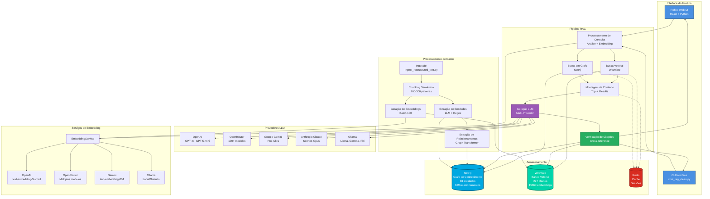
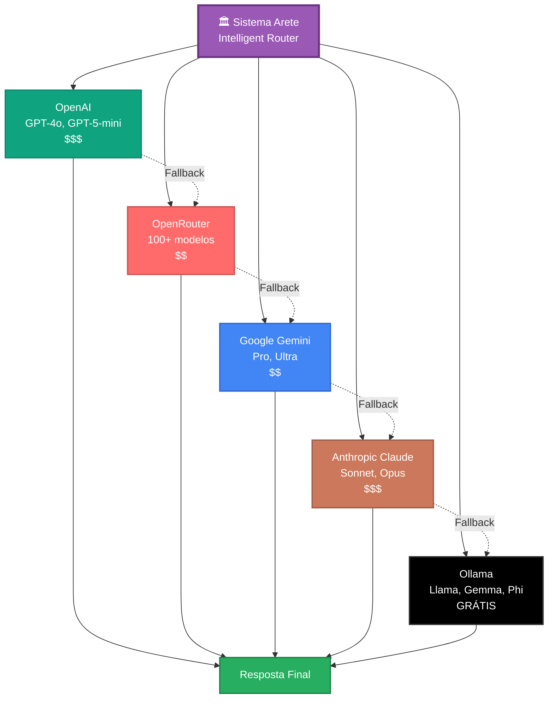
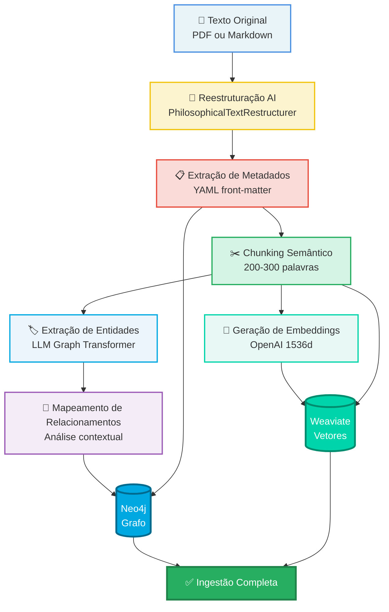
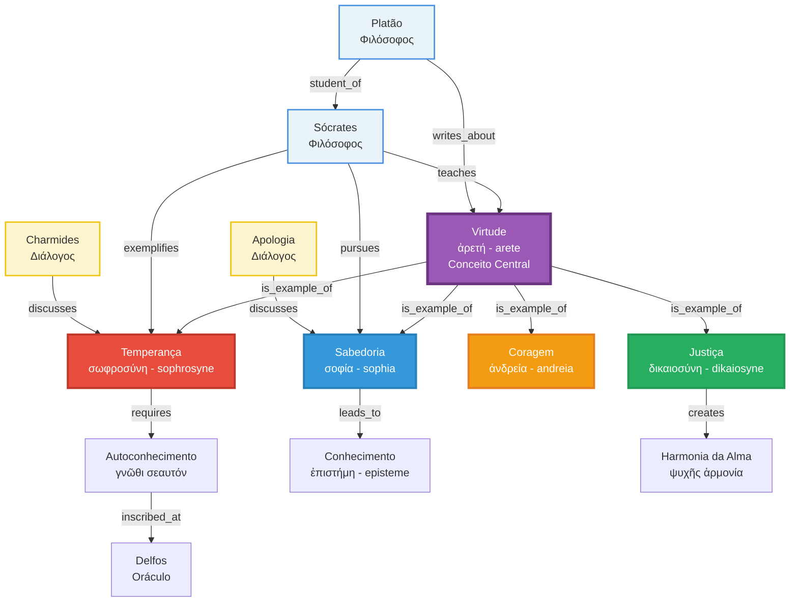
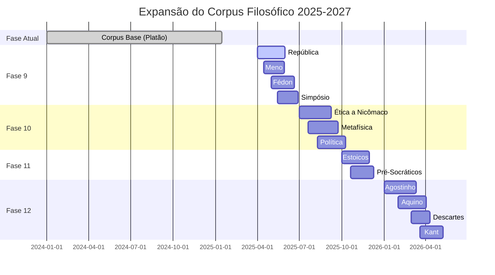

# Diagrama de Arquitetura do Sistema Arete

## 1. Arquitetura Completa (Slide 3 e 5)

### Versão Mermaid (Para Renderização)



---

## 2. Fluxo de Pipeline RAG Simplificado (Slide 5)

```mermaid
graph LR
    A[👤 Pergunta do Usuário<br/>'O que é virtude?'] --> B[⚡ Embedding<br/>1536 dimensões]
    B --> C[🔍 Busca Vetorial<br/>227 chunks<br/>Top 5 resultados]
    C --> D[🏛️ Consulta Grafo<br/>83 entidades<br/>Relacionamentos]
    D --> E[📝 Contexto Montado<br/>~5000 tokens]
    E --> F[🧠 GPT-5-mini<br/>Raciocínio 25-35s]
    F --> G[✅ Verificação<br/>Citações validadas]
    G --> H[📖 Resposta Estruturada<br/>+ Citações + Scores]

    style A fill:#E8F4F8,stroke:#4A90E2,stroke-width:2px
    style B fill:#FFF4E6,stroke:#F39C12,stroke-width:2px
    style C fill:#E8F8F5,stroke:#00D4AA,stroke-width:2px
    style D fill:#EBF5FB,stroke:#00A8E1,stroke-width:2px
    style E fill:#F4ECF7,stroke:#9B59B6,stroke-width:2px
    style F fill:#FADBD8,stroke:#E74C3C,stroke-width:2px
    style G fill:#D5F4E6,stroke:#27AE60,stroke-width:2px
    style H fill:#FCF3CF,stroke:#F1C40F,stroke-width:2px
```



---

## 3. Arquitetura Multi-Provedor (Slide 6)



### Benefícios Visualizados

```
💰 Otimização de Custos
   ┌─────────────────────────────┐
   │ OpenAI GPT-5: $0.03/1K tok  │ ← Raciocínio complexo
   │ OpenRouter: $0.001/1K tok   │ ← Consultas simples
   │ Ollama: GRÁTIS              │ ← Modo offline
   └─────────────────────────────┘

🔄 Confiabilidade
   ┌─────────────────────────────┐
   │ Provedor 1 indisponível → 2 │
   │ Provedor 2 rate-limit → 3   │
   │ Provedor 3 timeout → 4      │
   │ Provedor 4 falha → 5 (local)│
   └─────────────────────────────┘
   Uptime: 99.9%+

🎯 Especialização
   ┌─────────────────────────────┐
   │ GPT-5-mini: Filosofia       │
   │ Claude: Análise argumento   │
   │ Gemini: Multilíngue         │
   │ Llama3: Rápido/offline      │
   └─────────────────────────────┘
```

---

## 4. Pipeline de Ingestão (Slide 13)



### Estatísticas do Pipeline

```
📊 Métricas de Processamento (Apologia + Charmides)

ENTRADA:
├─ 2 documentos PDF
├─ 51.383 palavras totais
└─ ~120 páginas

PROCESSAMENTO:
├─ Reestruturação AI: ~15 minutos
├─ Chunking: 227 chunks criados
├─ NER: 83 entidades extraídas
├─ Relacionamentos: 109 mapeados
└─ Embeddings: ~3 minutos (batch 100)

SAÍDA:
├─ Neo4j: 83 nós + 109 arestas
├─ Weaviate: 227 objetos vetoriais
└─ Tempo total: ~20 minutos
```

---

## 5. Grafo de Conhecimento Exemplo (Slide 7)



### Tipos de Relacionamentos

```
🔗 Tipos de Edges no Grafo:

CONCEITUAIS:
├─ is_example_of: Conceito específico → Conceito geral
├─ requires: Conceito A precisa de Conceito B
├─ leads_to: Conceito A resulta em Conceito B
├─ contradicts: Conceito A ↔ Conceito B (incompatíveis)
└─ synthesizes: Conceito C = Conceito A + Conceito B

AUTORAIS:
├─ writes_about: Autor → Conceito
├─ discusses: Diálogo → Conceito
├─ exemplifies: Pessoa → Virtude
├─ teaches: Professor → Conceito
└─ student_of: Aluno → Professor

TEXTUAIS:
├─ appears_in: Conceito → Texto (frequência)
├─ mentioned_with: Conceito A co-ocorre Conceito B
└─ defined_as: Conceito → Definição

TEMPORAIS:
├─ precedes: Evento A antes de Evento B
├─ influences: Filósofo A → Filósofo B
└─ evolves_to: Conceito versão 1 → versão 2
```

---

## 6. Roadmap de Corpus (Slide 14)



### Crescimento do Corpus

```
📈 Projeção de Crescimento

JAN 2025 (Atual):
├─ Palavras: 51.383
├─ Chunks: 227
├─ Entidades: 83
└─ Relacionamentos: 109

JUL 2025 (Fim Fase 9):
├─ Palavras: 246.383 (+380%)
├─ Chunks: 1.217 (+436%)
├─ Entidades: 283 (+241%)
└─ Relacionamentos: 409 (+275%)

DEZ 2025 (Fim Fase 10):
├─ Palavras: 536.383 (+944%)
├─ Chunks: 2.677 (+1079%)
├─ Entidades: 533 (+541%)
└─ Relacionamentos: 809 (+642%)

JUN 2026 (Fim Fase 12):
├─ Palavras: 958.383 (+1765%)
├─ Chunks: 4.787 (+2008%)
├─ Entidades: 733 (+783%)
└─ Relacionamentos: 1.209 (+1009%)

2027+ (Visão):
├─ Palavras: 1.000.000+
├─ Chunks: 5.000+
├─ Entidades: 1.000+
└─ Relacionamentos: 2.000+
```

---

## 7. Instruções para Criação Visual

### Para PowerPoint/Google Slides:

1. **Copiar Mermaid Code** → Colar em https://mermaid.live
2. **Exportar como PNG** (alta resolução)
3. **Inserir em slide** mantendo proporções
4. **Adicionar anotações** se necessário

### Para Diagramas Customizados:

**Ferramenta Recomendada:** draw.io (diagrams.net)

**Paleta de Cores Arete:**
```
Primárias:
- Roxo Principal: #9B59B6
- Azul Neo4j: #00A8E1
- Verde Weaviate: #00D4AA

Secundárias:
- Azul Claro: #4A90E2
- Verde Sucesso: #27AE60
- Amarelo Aviso: #F1C40F
- Vermelho Erro: #E74C3C

Neutros:
- Cinza Escuro: #34495E
- Cinza Médio: #7F8C8D
- Cinza Claro: #ECF0F1
- Branco: #FFFFFF
```

**Fontes:**
- Títulos: **Inter Bold** ou **Roboto Bold**
- Corpo: **Inter Regular** ou **Roboto Regular**
- Código: **Fira Code** ou **JetBrains Mono**
- Grego: **New Athena Unicode** ou **GFS Didot**

---

## 8. Assets Adicionais Necessários

### Screenshots a Capturar:

1. **Reflex UI - Chat Interface** (Slide 4)
   - URL: http://localhost:3000
   - Resolução: 1920x1080
   - Mostrar: Conversa completa com resposta

2. **Reflex UI - Document Viewer** (Slide 4)
   - Split view: chat + documento
   - Highlight em citação

3. **Neo4j Browser** (Slide 7)
   - URL: http://localhost:7474
   - Query: `MATCH (n)-[r]->(m) RETURN n,r,m LIMIT 50`
   - Layout: Force-directed graph

4. **CLI Output** (Slide 12)
   - Terminal com fundo escuro
   - Comando + resposta completa
   - Font size: 14pt para legibilidade

### Icons e Logos:

Baixar logos oficiais de:
- OpenAI (logo + wordmark)
- OpenRouter
- Google Gemini
- Anthropic Claude
- Ollama
- Neo4j
- Weaviate
- Reflex

**Fonte:** Sites oficiais ou brandfetch.com

---

**Criado em:** 2025-01-03
**Versão:** 1.0 PT-BR
**Formato:** Markdown + Mermaid
**Uso:** Apresentação Arete - Diagramas de Arquitetura
